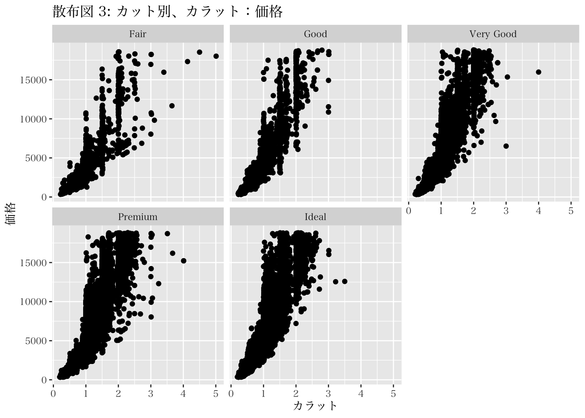

# データ整理と要約・可視化{#handling}

## 本章の概要
本章では、Rを用いたデータの処理と記述的な分析について紹介する。マーケティング領域では、様々なタイプのデータを扱うが、どのようなデータであってもデータを取り込み、分析可能な形に処理した後、データの特徴について確認することが必要になる。最終的に高度な統計分析を行うことを想定していたとしても、自身の獲得したデータの特徴を確認することは非常に重要である。そのため、本章ではデータの読み込みやデータ処理といった、分析の前に必要な技術的過程を紹介する。

これまでの内容にて本書では、データを収集するまでの注意点や方法を説明した。しかしながら、収集したデータをただ眺めているだけでは、定量的な知見を得ることはできない。そのため、以降の節では主にデータ処理や分析手法について説明する。まず我々は、データセットの構築から学ぶ。例えばあなたがアンケートを実施したならば、そのアンケートからデータセットを構築する努力が必要になる。アンケート結果に基づくデータセット構築において研究者はコーディング、トランスクライビング、データクリーニングのプロセスを経る。

コーディングは、回答を分析可能なフォーマットへ変換する作業であり、通常回答に対して数値を当てはめる作業を伴う。例えば、回答者が男性ならば 1 を、女性ならば 0 をとるようなダミー変数を作成する作業がこれに当てはまる。コーディングは、不必要な情報を減らすことでデータ化プロセスを担う。トランスクライビングは、質問紙に記載された回答をデータ入力していく作業である。入力に関するヒューマンエラーは起こるものとして考える必要があるため、通常このプロセスは二人一組でダブルチェックをしながら行う。なお、オンラインアンケートの際はこのプロセスは自動で行われるため、不要になる。

データクリーニングでは、研究者は不適切な回答のチェックを行う。例えば、回答可能範囲から外れた回答（例、7点尺度における8点回答）や、論理的に非整合的な回答（例、回答者が利用したことないと答えているサービスについて評価している場合） がないかをチェックする。また、欠損値という回答がない観測についてもチェックする必要がある。マーケティング分野においては欠損値のあるサンプルを削除するという方法も用いられるが、欠損値の扱いは奥が深く、いくつかの対応法がある。本書ではその詳細については扱わないが、欠損値に対応するためのデータ処理についての専門書も存在するため、関心のある読者はそれを参照してほしい（高橋・渡辺,  2017）。

データセットの構築が完了したあとは、分析を行うのだが、本章ではRを通じて実行可能な基本的なデータ分析手法を紹介する。Rには、様々な計算を実行するための関数が用意されており（例、mean, median, sqrt 等）、これらを使えば、分析者はシンプルなコマンドで分析が可能になる。関数のは `f(argument)` のように関数名 `f` のあとにカッコをつけて表記することで利用する事ができる。なお、`argument` は日本では引数とよばれ、計算に必要な情報の指定である。関数の利用において作業者は具体的な関数名とそれに対応する引数を指定する必要がある。例えば、データ（列ベクトル）`x` の平均値を計算したい場合には、以下のようなコマンドで実行できる。


``` r
mean(x)
```

ただし、 `na.rm = TRUE` はデータに欠損値がある場合に、それを無視して（欠損値でない観測値のみで）計算を行うための引数である。


Rの作業として本章では主に、1. データの読み込み（csv, excel, etc.）、2. dplyrの利用とデータ整形、3. パイプ演算子を用いた複数処理の実行、について学ぶ。なお、これらの作業は、統計的な分析を実行する前のデータ前処理としても広く使われるものなので、データ分析をしたいと考える人達にとってはとても重要なスキルになる。

分析可能な形にデータを処理した後は、データの特徴を確認することが必要になる。具体的には、記述統計や図示化を用いて、特定の変数の分布や変数間の関係について確認を行うことが重要である。この過程により、調査の背景にある実情を把握できるとともに、入手したデータ（のコーディングなど）にエラーがないかを確認することにもつながる。本章では、関数を用いた基本的な記述統計の計算はもちろん、先述のパイプ演算子を用いて、ある特徴を持つ観測における記述統計の計算などを簡単に行う方法も紹介する。

また、二変数間の関係を捉えるための基本的な指標である相関係数についても説明する。そこでは、相関係数の意味や係数の解釈における注意点についても紹介した後、データを可視化することの重要性も合わせて説明する。データの可視化においては主に、ggplot2 というパッケージを用いた方法を紹介する。本章では主にRパッケージ内に含まれているデータ例を用いて、可視化の方法を紹介するため、読者においてはぜひ自身の関心のあるデータを用いて実行してみてほしい。


## データの読み込み

本節で用いるパッケージをまだインストールしていない読者は、以下のコマンドを用いてインストールしてほしい。また、インストールを完了したら、library()関数によって各パッケージを起動し、作業に備えてほしい。


``` r
install.packages(c("tidyverse","readr","readxl"))
```


``` r
library(tidyverse)
library(readr)
library(readxl)
```


ここからは、データセットを用いた情報の取り込みとデータ処理作業を行っていく。多くの場合、R外部で作成されたデータを取り込み利用するのだが、あるソフトウェアで作成・保存されたデータセットが他の環境で利用できるとは限らないという点に注意が必要である。そのため、ソフト特性に依存しない汎用的な形式を使うことが好まれることも多い。汎用性の高いファイル形式の代表的な例がCSV (comma separated values) である。以下は、mktData.csvという架空のファイルをdfというオブジェクト名で取り込むための、見本コードである。ここで用いる関数は、readrというパッケージのread_csv() という関数である。なお、以下のコードは、実在しない 'mktData.csv'というデータセットを引数に利用した見本コードであるため、このコードをそのまま実行してもエラーを返すだけであることに注意をしてほしい。実際には、自身が利用するファイル名を指定してファイルを読み込むことになる。なお、以下のコードの2行目は、データの1行目に変数名（列名）が含まれていない場合の引数の指定方法である。また、下記コードで利用している `::` は用いるパッケージを指示するための演算子である。これにより、`library()` を用いなくても、指定したパッケージ内の関数を利用することができる。


``` r
df1 <- readr::read_csv("mktData.csv")
df2 <- readr::read_csv("mktData.csv", col_name = FALSE)
```

なお、R studioデスクトップ版を利用している場合には、ファイルが格納されているディレクトリ名も指定する必要がある。Rにおいては様々なファイルを入力・出力することになるため、利用するディレクトリが一貫していないとそれだけで作業が煩雑になる。そのため、\@ref(rusage)章 で紹介している「プロジェクト機能」必ずを活用するようにほしい。

本書で用いるデータは、有斐閣ウェブサイトを通じて配布している。そのため、読者においては各自のコンピュータにダウンロードし、分析用に活用してほしい。ここではまず、分析に利用するデータを格納するディレクトリを作成するコードを紹介する。以下のコードは、プロジェクトを作成しそのためのディレクトリを指定していることを前提にしている。 具体的は、以下の通りdir.create() を使ってproject内に新たに data というディレクトリ（フォルダ）を作成する。


``` r
dir.create("data")
```

新たなディレクトリを作成したら、そこに、ウェブサイトよりダウンロードしたデータを入れてほしい。ここではまず "2022idpos.csv"というデータを用いる。データが無事 data ディレクトリに含まれたら、以下のコマンドによってそのデータファイルをR の作業スペースに読み込み、それに "idpos" というオブジェクト名を定義する。なお、ここで分析者はディレクトリを指定することも必要になる。また、コード内の na は、欠損値がどのように保存されているかを指定するための引数であり、もし欠損値が空欄であればnaによる指定は必要ない。


``` r
idpos <- readr::read_csv("data/2022idpos.csv", na = ".")
```

問題なくデータを読み込むことができたら、そのデータの冒頭数行を head() 関数によって表示する。head() 関数の結果によって、このデータセットのうち、4つの変数（列）について6つの観測（行）が表示されるはずである。なお、R studio 画面内の Environment タブからこのidposデータが3000行、5列のデータセットであることを確認できる。


``` r
head(idpos)
```

```
## # A tibble: 6 × 4
##      id date      spent coupon
##   <dbl> <chr>     <dbl>  <dbl>
## 1    12 2019/9/25 14326      1
## 2    32 2019/9/10 10232      1
## 3    30 2019/9/9   6881      1
## 4    29 2019/9/4   6365      0
## 5    46 2019/9/10  7595      1
## 6    44 2019/9/14  7858      0
```

また、読み込んだデータ特徴の確認は他の関数でも実行できる。例えば、name() 関数を使えば、データ内の変数名 (列名) を確認できるし、tidyverseに含まれる glimpse() 関数によってもデータの冒頭数行を含むいくつかの情報を返してくれる。


``` r
names(idpos)
```

```
## [1] "id"     "date"   "spent"  "coupon"
```

``` r
glimpse(idpos)
```

```
## Rows: 3,000
## Columns: 4
## $ id     <dbl> 12, 32, 30, 29, 46, 44, 44, 32, 3, 34, 36, 3, 42, 18, 38, 4, 19…
## $ date   <chr> "2019/9/25", "2019/9/10", "2019/9/9", "2019/9/4", "2019/9/10", …
## $ spent  <dbl> 14326, 10232, 6881, 6365, 7595, 7858, 9405, 1821, 8375, 1828, 6…
## $ coupon <dbl> 1, 1, 1, 0, 1, 0, 0, 0, 0, 1, 1, 0, 0, 0, 1, 1, 1, 1, 1, 0, 1, …
```

なお、このidposデータは、POS (Point of sales) という小売店レジでの取引データとロイヤルティプログラムなどの会員IDを含むID-POSと呼ばれるデータを想定して簡略化し作成した、演習用人工データである。データには、小売店舗での取引日（date）、金額（spent）、クーポン利用の有無 (coupon)、性別 (gender) が含まれている。本来のPOSデータは、より詳細な日時や具体的な製品単品レベルの取引品目など、より詳細な情報が含まれているはずだが、ここでは簡単化のためにこのようなデータにしている。また、もしスプレッドシート形式で表示したい場合には View() 関数をconsoleに直接入力することでそれが可能になる。例えば、idposデータを用いて以下のようなコードを入力することで、Sourceウィンドウに新しいタブができ、そこにデータセットが表示される。


``` r
View(idpos)
```

## データの整形
### tidyverse の活用
データの整形には、tidyverseパッケージ群に含まれるdplyrというパッケージを用いる。作業では、tidyverseをインストール・起動しておけばdplyrも利用できるため、特に心配する必要はない。dplyr には、いくつもの便利な関数がふくまれているが、本節では主に以下の関数および機能を紹介する。

1. summarize(): 
  - データセットを関数内で定義した統計量等を用いて要約された新しいデータセットに変換するための関数
2. mutate(): 
  - データセットに新しい変数を追加するための関数
3. filter(): 
  - データセットから、関数内で指示する特定のレコード（行）を残す（フィルタリング）するための関数
4. select(): 
  - データセットから、関数内で指示する特定の列を抽出するための関数
5. arrange(): 
  - データセットから、関数内で指示する順番で並べ替えるための関数
6. パイプ演算子 %>%:
  - 前（左）の関数の出力を次（右）の関数の入力として渡すため演算子

`summarize` は、ある変数の平均値や標準偏差などの記述統計量を計算することができる関数である。例えば、dataというデータセットに含まれる var_name という変数の平均値を計算し、それを M という変数名として定義する場合、以下のコマンドを用いる（以下のコマンドは見本コードである）。

``` r
summarize(data, M = mean(var_name))
```

`mutate` は、データセットに引数内で指定した定義の変数（列）を追加する関数である。例えば、以下の見本コードにような指示によって、`data` というデータセットに対し、`definition` で定義した変数を`new_var`として追加することができる。実際の分析で`definition`を定義する場合には、様々な関数や論理式を利用する事が多い。例えば、"new_var = var1/100" という定義を用いれば、var1を1/100倍した値をnew_varとして定義することになる。また、"new_var = var1 – mean(var1)"という定義を用いれば、var1の観測値からvar1の平均値を引いた値をnew_varとしている。なお、このような操作化を一般的に「中心化」と呼ぶ。


``` r
mutate(data, new_var = definition)
```

また、mutate関数の利用においては、条件分岐を用いた変数の作成を行うこともある。そのように、研究者がある変数の値に応じて異なる値を変数を作成するときには、mutate内で、ifelse()関数を用いる事が多い。ifelse() 内の第一引数は条件、第二引数は条件が満たされたときの処理、第三引数は条件が満たされないときの処理をそれぞれ表す。なお、特定の条件の指定には "==" （同値）, ">="（以上）, "<="（以下） を使う。具体的には、var1 が2ならば1をとり、それ以外であれば０をとるという条件でnew_varを作成するという指示は、以下のようになる（以下は見本コードである）。


``` r
mutate(data, new_var = ifelse(var1 == 2, 1, 0))
```

`filter`関数は、データから特定の条件に合致する行だけ取り出す場合に用いる関数である。例えば、男性（gender == "male"）のサンプル情報のみ抽出したい場合には以下のような指示になる。


``` r
filter(data, gender == "male")
```

なお、特定の条件以外のものを指定したいときは、 という論理式 "!=" (not equal) を使う。男性以外の行を選ぶための指示は、以下の通りになる。


``` r
filter(data, gender != "male")
```

select関数は、特定の変数（列）を選んで新たなデータフレームを作成することができる関数である。例えば、dataというデータセットから、var1、var2、var3 という変数（列）を抽出して、data2というdataframeとして定義するには、以下のような指示になる。


``` r
data2<- select(data, var1, var2, var3)
```

反対に、取り除きたい変数を指定するときには、以下のように "-" を使う。


``` r
data2<- select(data, -var1)
```

列の指定方法には、いくつかのやり方が存在する。並んでいる列をまとめて指定するときは:（コロン）を使う。例えば、var1からvar5までの列をまとめて抽出し、それをdata2として定義するのは以下のようにできる。


``` r
data2<- select(data, var1:var5)
```

また、tidyverseのstarts_with()（ends_with()）を使うことで、変数名の冒頭（末尾）が特定の文字列から始まる変数を指定するようなことも可能である。例えば、"v" という文字から始まる変数を取り出すための指示は、いかのようになる。

``` r
data3<- select(data, starts_with("v"))
```

arrangeは、データの並べかえを可能にする関数である。例えば、以下ではvar1の値が小さい順（昇順）に並べ替えるような指示を示す。一方で、降順にする場合は、desc(var1)と引数を指定する必要がある^["desc"は、descending orderの略であり、降順を表す。]。


``` r
data2 <- arrange(data, var1) 
data2 <- arrange(data, desc(var1)) 
```

また、tidyverse環境において、変数名を変更することも、rename() 関数で可能になる。以下の指示によって、`var_name` という変数を `new_name` に変更する事ができる。


``` r
data3 <- rename(data2, new_name = var_name)
```

dplyr を活用すると、パイプ演算子（%>%）が使える（ショートカット: command (control) + Shift + m）。パイプ演算子は、左側の処理結果を演算子右側の関数の第一引数として利用するための指示である。たとえば、以下のコマンドではまず $\small 10-6$ が計算され、その結果である "4" が `sqrt()` の引数として利用される（sqrt(4) は 2）。


``` r
(10-6) %>% sqrt()
```

```
## [1] 2
```

パイプ演算子は、複数のデータ操作処理を連続して行う際に便利である。例えば、顧客の情報を含むデータセット(data)から、男性に該当する情報のみを抽出し、var1(例、購買額)についてのランキングを作成したうえでいくつかの変数を含んだデータセット（new_data）を作成する場合を考える。その際に実行すべき作業とそれらに対応する関数は以下のように示すことができる。

1. 男性の情報だけ抜き出す(filter)
2. Var1の値について降順に並べ替える(arrange)
3. 第一位から最下位までの順位を割り当てた　ranking 変数を作る(mutate)
4. var1 , var2, var3, var4, rankingだけ残し(select) new_dataとして定義する

上記の作業を一気に行うためのコードをパイプ演算子を使わずに書くと以下の様になる（以下は見本コード）。


``` r
new_data <- select(
　mutate(
　　arrange(
　　　filter(data, gender == "male"),
　　　desc(var1)),
　　　ranking = 1:n()),
　 var1, var2, var3, var4, ranking)
```

パイプ演算子を使わない場合、先に実行する処理が内側に来ており、一見して何を行っているのか理解するのが難しい。一方でパイプ演算子を使い、左側の処理結果を演算子右側の関数の第一引数として利用すると、以下のように書き換えることができる。


``` r
new_data <- data %>%
 filter(gender == "male")%>%
 arrange(desc(var1)) %>%
 mutate(ranking = 1:n()) %>% 
 select(var1, var2, var3, var4, ranking)
```

パイプ演算子の利用により、各関数の処理を一つの行で示せる。また、処理の順番通りに関数を記載することが可能なので、コードの記述容易性と可読性の両方が高まる。また、パイプ演算子による操作は次の関数の第一引数以外に反映されることも可能である。第一引数以外の引数に左側の処理結果を反映させる際には、該当する箇所に "." （ドット）を使う。たとえば、$\small 10-2$の計算結果を用いて2から8までの偶数で構成されるベクトルを返すためのコードは以下のように書くことができる。


``` r
(10-2) %>% 
  seq(from = 2, to = ., by = 2)
```

```
## [1] 2 4 6 8
```

データの整形・処理作業が終わったら、そのデータを自身のコンピュータ内のストレージに保存したいと考えるかもしれない。Rでは、外部への書き出しという形でデータを保存することが可能である。例えば、df という名前のデータフレームをnew_dataというファイル名で、dataというディレクトリにcsv形式を用いて保存するためには、以下のようなコードを用いる（以下は見本コード）。また、csv以外にもファイル形式は選択可能であり、例えばRのデータ形式(.Rds)で保存する場合には、"#Rds" 以降のコードを用いる。


``` r
readr::write_csv(df, path = "data/new_data.csv")

#Rds
readr::write_rds(df, path = "data/new_data.Rds")
```

### 企業データの処理

これまでに学んだデータ処理の手法を実行するために、本節では、 `MktRes_firmdata.xlsx`データを用いる。このデータをwebサイトより `data` ディレクトリにダウンロードし、以下の要領で読み込んでほしい。


``` r
firmdata <- readxl::read_xlsx("data/MktRes_firmdata.xlsx")
```


このデータは、小売・サービス分野の企業約160社（企業数は年によって異なる）に関する2010年から2019年までの財務データである（計1440件）。このデータは、日本生産性本部における顧客満足度調査の対象になっている企業リストを作成し、その企業の中から金融領域の企業や、データを入手できなかった一部の企業を教育的意図から排除したものである。したがって、日本の小売・サービス分野において全国的に知名度のある代表的な企業の財務データ（の一部）だと考えられる。

なお、本データには以下の変数が含まれており、データ内の単位は従業員数（人）を除き百万円である。

- fyear: 決算年
- legalname: 企業名
- ind_en: 日経業種名（英文）
- parent:親会社名（もしあれば）
- fiscal_month: 決算月
- current_liability: 流動負債
- ltloans: 長期借入金
- total_liability: 負債合計
- current_assets: 流動資産
- ppent: 有形固定資産
- total_assets: 資産合計
- net_assets_per_capital: 純資産合計／資本合計
- sales: 売上高
- sga: 販売費及び一般管理費
- operating_profit: 営業利益
- net_profit: 当期純利益
- pnet_profit: 親会社株主に帰属する当期純利益（連結）／当期利益（単独）
- re: 利益剰余金
- adv: 広告・宣伝費
- labor_cost: 人件費
- rd: 研究開発費
- other_sg: その他販売費及び一般管理費
- emp: 期末従業員数
- temp: 平均臨時従業員数
- tempratio: temp/(emp+temp)
- indgrowth: 産業成長率
- adint: 広告集中率（adv/sales）
- rdint: 研究集中率（rd/sales）
- mkexp:  (sga - rd) / sales
- op: operating_profit / sales
- roa: pnet_profit / total_assets 

本データセットは、複数年にわたる複数サンプルからのデータであり、一般的にこのような構造のデータをパネルデータという。パネルデータの分析の概要は \@ref(causation4) 節で紹介している。

ここではこのデータを用いて、以下の作業を行う。

1. 2018年度のデータのみを抽出する。
2. 企業名、年、売上高、人件費、期末従業員数、平均臨時従業員数のみの変数を含むデータセットにする。
3. 労働単価（人件費/（期末従業員数+平均臨時従業員数））変数を作成する。
4. 労働単価の高い順に並び替えてトップ10企業を出力する。


``` r
firm2018_check <- firmdata %>% 
  filter(fyear == 2018) %>% 
  select(legalname, fyear, sales, labor_cost, emp, temp) %>% 
  mutate(wage = labor_cost/(temp+emp), na.rm=TRUE) %>% 
  arrange(desc(wage))

head(firm2018_check, n = 10)
```

```
## # A tibble: 10 × 8
##    legalname                    fyear   sales labor_cost   emp  temp  wage na.rm
##    <chr>                        <dbl>   <dbl>      <dbl> <dbl> <dbl> <dbl> <lgl>
##  1 株式会社リクルート            2018 2310756     388583 45856  2449  8.04 TRUE 
##  2 株式会社 大丸松坂屋百貨店     2018  459840      62692  6695  3581  6.10 TRUE 
##  3 株式会社 大丸松坂屋百貨店     2018  459840      62692  6695  3581  6.10 TRUE 
##  4 株式会社 帝国ホテル           2018   58426      17307  1940   998  5.89 TRUE 
##  5 株式会社 髙島屋               2018  912848      83779  7761  8849  5.04 TRUE 
##  6 株式会社コメリ                2018  346862      43991  4646  4777  4.67 TRUE 
##  7 株式会社オートバックスセブン  2018  213840      22139  4171   747  4.50 TRUE 
##  8 株式会社ロイヤルホテル        2018   40884      13115  2049   894  4.46 TRUE 
##  9 オルビス株式会社              2018  248574      28555  4181  2330  4.39 TRUE 
## 10 株式会社ファンケル            2018  122496      15103  1381  2213  4.20 TRUE
```

このように、データの中から研究課題と整合的な情報を抽出したり、変数を作成したりすることができる。ただし、研究者にとって都合の良い結果を得るために恣意的に用いるデータを制限、操作することは、研究不正となる。そのため、実際の研究では、どのようなデータ・情報を用いるかについて事前に計画しておく必要がある。

## データの要約と可視化

本設以降では、記述統計や可視化によってデータを要約する方法について説明する。記述統計では、統計量と呼ばれる指標を用いてデータの特徴を数値から把握する。一方で可視化においては、図表を作成することでデータの特徴を視覚的に理解することを目的とする。実証的なマーケティング研究においては、データを用いた仮説の検証という方法が主流かもしれないが、仮説検証に用いるデータはどのようなものなのかを要約し、それを（論文やレポートの）読者へ伝えるプロセスは必要である。記述統計やデータの可視化は、このプロセスにおいて機能する方法である。

### 記述統計
記述統計の利用においては、データのタイプ別に利用すべき統計量が異なることに注意が必要である。データには量的変数とカテゴリ（を示す質的）変数があるが、量的変数は数値で測定できるものであり、その計算結果を解釈することも可能である。一方でカテゴリ変数は、各観測個体が属している状態やグループを表す指標であり、それを計算してもそこから含意を得るのが難しい。Rのような統計ソフトは非常に素直なので、たとえカテゴリ変数であってもそこに数値が入力されていれば、記述統計に必要な計算を実行し、結果を返してくれる。しかしながら研究においてはそれらの結果を適切に解釈する必要があり、自身が用いている変数のタイプに応じた分析を実行する必要がある。

その上で本節ではまずひとつの量的変数の情報を要約するための記述統計を紹介する。一つの数値によってデータ全体を代表させるような数値を代表値と呼ぶ。代表値は主に、データの中心を示す指標と考えられる。本節ではデータの中心を表す指標として中央値 (median) と平均値 (mean) を紹介する。中央値は、データのすべての観測値において、その値より小さな観測値の数と大きな観測値の数が等しくなるような真ん中の値を表す。そのため、（1, 3, 2, 5, 4）というデータにおける中央値は3である。これは、このデータを、1, 2, 3, 4, 5 と並べ替えると、3よりより小さな観測値の数と大きな観測値の数が等しくなっていることから確認できる^[一方でデータの観測数（ $n$ ）が偶数である場合、$\small n/2$ 番目と、$\small (n/2)+1$ 番目が中央となるため、n個のデータの観測値を、$x_1,x_2,...,x_n$ とすると、これらふたつの値の平均値（ $\small \frac{x_{\frac{n}{2}}+x_{ \frac{n}{2}+1}}{2}$ ）が中央値となる。Rにおいては`median()` 関数によって以下のように計算することができる。]。

``` r
d <- c(1, 3, 2, 5, 4)
median(d)
```

```
## [1] 3
```

``` r
d2 <- c(1, 3, 2, 5, 4, 6)
median(d2)
```

```
## [1] 3.5
```

平均値（算術平均と呼ばれる）は、最もよく使われる代表値の一つである。平均値は、n個のデータ、$\small x_1,x_2,...,x_n$ に対して以下のように定義される。

$$\bar{x} = \frac{1}{n}\sum_i^n x_i$$

観測値と平均値の差（$x_i - \bar{x}$）は偏差と呼ばれ、偏差の和はゼロである（$\sum_ix_i - \bar{x}=0$）という性質を持つ。つまり、平均値を中心として、データの正の方向へのばらつきと負の方向へのばらつきが釣り合いが取れているということが伺える。この点が、平均値がデータの中心を表す代表値として用いられるひとつの理由である。また、平均値にはいくつかの好ましい統計的性質があるのだが、それについては後述する。Rにおいては、`mean()` 関数を用いることで分析が可能である。例えば、9人の生徒に対して行われた数学(x)と国語(y)のテスト(10 点満点)の結果が、それぞれ以下の通りであったとしよう。

- 数学: (3,3,5,5,5,5,5,7,7)
- 国語: (2,3,3,5,5,5,7,7,8)

このときの平均値は以下のように求まる。


``` r
math <- c(3,3,5,5,5,5,5,7,7)
jpn <-  c(2,3,3,5,5,5,7,7,8)

mean(math)
```

```
## [1] 5
```

``` r
mean(jpn)
```

```
## [1] 5
```

計算の結果、どちらも平均値は5であった。データの中心を表す代表値の値が等しかったため、これら2科目のテスト結果は同じ分布を持つと判断して良いのだろうか。自明かもしれないが、そのような解釈は不適切である。具体的には、データの「ばらつき」についても確認する必要がある。分布のばらつきは、平均値からの離れ方(平均値からの偏差) によって判断される事が多く、これが大きなデータが多い場合は、よりデータは散らばっ て分布していると解釈される。一方でデータが平均の近くに集まって分布している場合、ばらつきが小さいと捉えられる。この分布のばらつきは主に、分散や標準偏差という指標で測られる。

分散 (Variance, $S^2$で定義する) は以下のように、平均からの偏差の二乗の和をデータ数で割ったものだと定義される。平均からの偏差の和を計算すると、正の方向へのズレとマイナス方向へのずれがあるので、互いに相殺しあって合計は 0 になる。そこで、偏差の二乗和を用いることでデータ全体がどの程度平均からばらついているかを把握する。
$$S^2 = \frac{1}{n}\sum_i^n (x_i-\bar{x})^2$$

しかしながら、分散は元の値を二乗しているのでもとのデータと単位が異なる。そのため、分散の正の平方根 ($\sqrt{\cdot}$) を取った値を標準偏差と呼び、この標準偏差を用いることも多い^[偏差の二乗和のかわりに偏差の絶対値を用いた平均偏差という指標も存在する。しかしながら、分散や標準偏差のほうが好ましい統計的性質を持つことから、二乗和が用いられることが多い。]。なお、Rでは `var()` と `sd()` によって分散と標準偏差をそれぞれ求める。ただし、Rの関数による計算では $s^2=\frac{1}{n-1}\sum_i^n (x_i-\bar{x})^2$ で定義される「不偏標本分散」および「不偏標準誤差」という指標を用いる。これらの指標は、不偏性（\@ref(pestimate)節参照）という統計的に好ましい性質を持っているため、分析ソフトではこちらの計算方法が用いられる。そのため、Rを用いた分散の計算値が n で割った際の手計算値と異なることがあるのでその点には注意が必要である。


``` r
var(math)
```

```
## [1] 2
```

``` r
var(jpn)
```

```
## [1] 4.25
```

先程の数学と国語のテスト結果データを用いて分散を計算すると、国語の方が分散が大きいことがわかる。つまり、両テストとも平均値は同じであるものの、国語のほうがそのスコアのばらつきが大きいことがわかる。このように、代表値とともにデータのばらつきに関する情報も踏まえてデータの特徴を把握することが好ましい。

観察されたデータと標準偏差を用いて、特定の観測結果がデータ内において「相対的に」どのような位置にいるのかを捉えることも可能になる。具体的には、任意の量的変数 $x_1,...,x_n$ に対して、標準化されたスコア $z_1,..,z_n$ は以下のように定義できる。

$$
z_i=\frac{(x_i-\bar{x})}{\sqrt{(S^2)}}
$$

ただし、 $S^2$ は変数 $x$ の分散である（不偏標本分散を用いることもある）。上記定義の通り、標準化スコアは観測値の平均からの偏差を標準偏差で割っており、ある観測が平均値から標準偏差何個分ズレているかを示していると解釈できる。なお、標準化スコアは、平均が0、分散が1になることも知られている。

## カテゴリ変数の要約
一方でカテゴリ変数は、代表値や分散によって含意を得るのではなく、頻度のカウント（集計）や、クロス集計を用いることが多い。これにより、各カテゴリにどれぐらいの観測数があるのかを確認することが可能になる。カテゴリ変数の内容（出現頻度）の確認には、`table()` 関数を用いる。また、`with()`関数を用いて同様の結果を得ることも可能である。ここでは、先ほど用いた `firmdata` から2018年度の情報を抽出し、日経業種に基づく産業の違いから、どのカテゴリの企業がどれだけデータ内にいるのかを確認する。なお、tidyverseを起動していない場合には、必要に応じて `library(tidyverse)` を事前に指示してほしい。


``` r
firm2018 <- firmdata %>% 
  filter(fyear == 2018)

table(firm2018$ind_en)
```

```
## 
##       Air Transportation       Amusement Services          Bakery Products 
##                        8                        4                        1 
##   Communication Services Cosmetics & Toilet Goods        Department Stores 
##                        2                        3                        8 
##               Foods, NEC          Home & Pre-Fabs                   Hotels 
##                        1                        2                        5 
##   Miscellaneous Services Miscellaneous Wholesales           Motor Vehicles 
##                       27                        2                        4 
##       Musical Instrument         Railroad (Major)         Railroad (Minor) 
##                        1                       27                        2 
##      Real Estate - Sales       Retail Stores, NEC       Supermarket Chains 
##                        1                       35                       14 
##                 Trucking 
##                        1
```

``` r
with(firm2018, table(ind_en))
```

（こちらの出力結果は省略）

また、table関数にて2つのカテゴリ変数を指定することで、両変数に対応するカテゴリの出現頻度を返してくれる。このような表のことをクロス集計表とよぶ。例えば、同データにおける広告集中的な企業を把握するため、広告集中度が中央値よりも高ければ1、それ以外であれば0を取るダミー変数（\@ref(dummy)節参照）を作成し、各産業カテゴリとの関係を確認する。


``` r
firm2018 <- firm2018 %>% 
  mutate(ad_dummy = ifelse(adint > median(adint),1, 0))
with(firm2018, table(ind_en,ad_dummy))
```

```
##                           ad_dummy
## ind_en                      0  1
##   Air Transportation        4  4
##   Amusement Services        4  0
##   Bakery Products           0  1
##   Communication Services    1  1
##   Cosmetics & Toilet Goods  0  3
##   Department Stores         0  8
##   Foods, NEC                0  1
##   Home & Pre-Fabs           0  2
##   Hotels                    5  0
##   Miscellaneous Services   17 10
##   Miscellaneous Wholesales  1  1
##   Motor Vehicles            0  4
##   Musical Instrument        0  1
##   Railroad (Major)         27  0
##   Railroad (Minor)          2  0
##   Real Estate - Sales       0  1
##   Retail Stores, NEC       11 24
##   Supermarket Chains        2 12
##   Trucking                  1  0
```
上の表では、各行に産業名が記載されており、その右隣に、広告集中度が低い（`ad_dummy=0`）企業数が、さらにその右隣には広告集中度が高い（`ad_dummy=1`）企業数がそれぞれ記載されている。これらのデータを確認すると、鉄道会社やアミューズメント、ホテル、トラック運送業において広告集中度が高い企業が少ないことがわかる。それ以外では産業内でも広告集中度の高い企業と低い企業とが比較的バラけている。

特定のカテゴリに着目して、カテゴリ変数についての集計を行うことも可能である。例えば、広告集中度が高い企業における産業のばらつきを調べたいときには、`filter()` 関数を用いれば良い。


``` r
firm2018 %>% 
  filter(ad_dummy == 1) %>% 
  with(table(ind_en))
```

```
## ind_en
##       Air Transportation          Bakery Products   Communication Services 
##                        4                        1                        1 
## Cosmetics & Toilet Goods        Department Stores               Foods, NEC 
##                        3                        8                        1 
##          Home & Pre-Fabs   Miscellaneous Services Miscellaneous Wholesales 
##                        2                       10                        1 
##           Motor Vehicles       Musical Instrument      Real Estate - Sales 
##                        4                        1                        1 
##       Retail Stores, NEC       Supermarket Chains 
##                       24                       12
```

カテゴリ変数と量的変数の関係を調べることも、グループ別に量的変数の要約を行う形で可能である。具体的には、 `group_by()` 関数を用いる。`group_by()` は関数内で指定した変数を用いてデータをグループ化し、グループごとの集計や処理を可能にする関数である。例えば、売上高と広告集中度の平均と標準偏差を産業ごとに確認することは、以下のような指示で可能になる。


``` r
firm2018 %>% 
  group_by(ind_en) %>% 
  summarize(obs = n(),
            sales_m = mean(sales),
            sales_sd = sd(sales),
            adint_m = mean(adint),
            adint_sd = sd(adint))
```

```
## # A tibble: 19 × 6
##    ind_en                     obs  sales_m sales_sd adint_m adint_sd
##    <chr>                    <int>    <dbl>    <dbl>   <dbl>    <dbl>
##  1 Air Transportation           8 1772786.  305240. 0.00311  0.00333
##  2 Amusement Services           4  298138.  263017. 0        0      
##  3 Bakery Products              1 1059442       NA  0.0122  NA      
##  4 Communication Services       2  547088.  172736. 0.0231   0.0327 
##  5 Cosmetics & Toilet Goods     3  140669.  100063. 0.108    0.0498 
##  6 Department Stores            8  795322.  350240. 0.0199   0.00507
##  7 Foods, NEC                   1  504153       NA  0.0229  NA      
##  8 Home & Pre-Fabs              2 4143505        0  0.00857  0      
##  9 Hotels                       5   62135.   58060. 0        0      
## 10 Miscellaneous Services      27  311867.  456037. 0.0114   0.0204 
## 11 Miscellaneous Wholesales     2  176520    52778. 0.0203   0.0287 
## 12 Motor Vehicles               4 5279122. 4233188. 0.0254   0.00404
## 13 Musical Instrument           1  434373       NA  0.0443  NA      
## 14 Railroad (Major)            27 1302921. 1037834. 0        0      
## 15 Railroad (Minor)             2  260502        0  0        0      
## 16 Real Estate - Sales          1 1861195       NA  0.0114  NA      
## 17 Retail Stores, NEC          35  571019.  547247. 0.0243   0.0272 
## 18 Supermarket Chains          14 4335164. 3511347. 0.0147   0.00782
## 19 Trucking                     1 1118094       NA  0       NA
```

このように、カテゴリごとの量的変数の要約も実行可能である。なお、標準偏差が `NA` となっている箇所は、観測数が 1 であり、標準偏差を計算できない状況を表している。

## データの可視化

本書でのデータの可視化では、主にtidyverse内に含まれる ggplot2 というパッケージを用いる。データの可視化では、円グラフ、折れ線グラフ、帯グラフなどの様々なグラフを用いて視覚化されることも多いだろう。しかしなが本節では、主にヒストグラム、箱ひげ図、バイオリンプロットをRでの実行例とともに紹介する。これらの図は、量的変数の分布を視覚的に示すことについて優れた可視化の方法だと言える。ここでは、ggplot2に内包されている diamonds データを用いて可視化を学ぶ（tidyverseを起動することで自動的に ggplot2も起動されるため、このタイミングでtidyverseを起動していない場合には、必要に応じて `library(tidyverse)` によってパッケージを起動してほしい）。diamonds データについては以下のように確認できる。


``` r
head(diamonds)
```

```
## # A tibble: 6 × 10
##   carat cut       color clarity depth table price     x     y     z
##   <dbl> <ord>     <ord> <ord>   <dbl> <dbl> <int> <dbl> <dbl> <dbl>
## 1  0.23 Ideal     E     SI2      61.5    55   326  3.95  3.98  2.43
## 2  0.21 Premium   E     SI1      59.8    61   326  3.89  3.84  2.31
## 3  0.23 Good      E     VS1      56.9    65   327  4.05  4.07  2.31
## 4  0.29 Premium   I     VS2      62.4    58   334  4.2   4.23  2.63
## 5  0.31 Good      J     SI2      63.3    58   335  4.34  4.35  2.75
## 6  0.24 Very Good J     VVS2     62.8    57   336  3.94  3.96  2.48
```

なお、Macのデスクトップ版でggplot2等を使うと日本語が文字化けするので、Macユーザーは別途以下のコマンドを実行する必要がある。


``` r
#For mac users
theme_set(theme_gray(base_size = 10, base_family = "HiraMinProN-W3"))
```


本書の可視化では、まず、ggplot2の `ggplot()` 関数を用いて図示化のためのオブジェクトを作成する。この関数では、以下の引数を指定する。

- data: 可視化に用いるデータフレームの指定
- mapping: データから抽出する変数と画面に表示される図との関係の指定
  - mapping内で、`aes()` 関数（aesthetics）で視覚化に用いる変数とプロット要素間の接続を図ることも多い。

`aes()` 関数は、データ内の変数がをどのように視覚的情報（美的特性）にマッピングするか（例えば、x軸とy軸の変数はなにか）を特定するための関数である。こらの引数により、ggplot関数で作成された図示化オブジェクトには、着目するデータと変数が特定される。

続いて、ggplot()で作られたオブジェクトに対して、geom (geometry) に関する情報を 追加し、グラフィックの層(layer)を加えることで図を作成する。このプロセスでは、`geom_point()` による散布図や、`geom_histogram()` によるヒストグラムなど、具体的な図表のタイプに対応する関数を利用することで、図を作成できる。また、geomに関する関数以降に `labs()` というラベルに関する関数を追加することで、図に必要な情報を加筆することが可能になる。

ggplot2を用いたデータ可視化の例として、まずはヒストグラムを描画する。ヒストグラムはデータの分布を離散的に示すものであり、連続変数を階級で分けて各階級の頻度を図示化する。ヒストグラムは一つの変数を扱った図なので、mapping引数ではひとつの変数を指定する。その上で作成した図示化オブジェクトに `geom_histogram()` を追加することでヒストグラムを描画する。以下では、ダイアモンドの価格の観測頻度についての可視化例を紹介する。以下の図では、価格の程度を離散的に区切り、その区切られた各範囲の価格を取る観測がデータ内にどれだけ存在するかを示している。


``` r
p1 <- ggplot(diamonds, mapping = aes(x = price))
p1 + geom_histogram() +
  labs(x = "価格", y = "頻度",
       title = "ヒストグラム1: ダイアモンド価格")
```


なお、縦軸を確率密度(density)に変えるときは、geom_density()を用いる。その際、fillという引数を設定すると、密度を範囲に色を塗ることができる (なお、"p1" というオブジェクトは再利用できるので、再びggplot()によって指定する必要はない)。


``` r
p1 + geom_density(fill = "black", alpha = 0.5) +
  labs(x = "価格", y = "頻度",
       title = "ヒストグラム2: ダイアモンド価格（geom_density）")
```


次に、箱ひげ図の作り方を紹介する。箱ひげ図は、四分位数と四分位範囲等を図示化したものである。四分位数はデータを4等分する区切りの値であり、第一四分位はQ1、第二四分位はQ2、第三四分位はQ3、最大値はQ4で示される。四分位範囲はQ3-Q1の範囲で示されるものである。ここでは、Cutの質（Fair, Good, Very Good, Premium, Ideal）ごとに価格の分布を比べるため、複数の箱ひげ図を並べる例を提示する。


``` r
p2 <- ggplot(diamonds, mapping = aes(x = cut, y = price))
p2 + geom_boxplot() +
  labs(x = "Cutの質", y = "価格",
       title = "箱ひげ図1: ダイアモンド価格")
```


箱ひげ図を作成すると、ひげの上下に点が表示されることがある（上図では上部が太線のように見えている）。これは、外れ値の候補として全体の分布から離れて存在する観測値が示されている。ここで示される外れ値の候補は、Q1よりも四分位範囲$\times 1.5$ 以上小さい、ないしは、Q3よりも四分位範囲$\times 1.5$ 以上大きいかで特定される。外れ値がある場合、入力ミスなどのエラーではないか、異質な観測値でないか、を検討、確認することが必要になる。

次に紹介する図のタイプはバイオリンプロットである。バイオリンプロットは、箱ひげ図よりももう少し詳しくデータの分布を確認できる図である。ggplot2では、`geom_violin()` を用いる。例えば、先程の箱ひげ図をバイオリンプロットで示すと、以下のようになる。以下の図は、バイオリンプロット内に箱ひげ図を示すことでよりわかりやすい図を作成するように工夫している。


``` r
p2 + geom_violin() +
  geom_boxplot(fill = "gray", width = 0.1) +
  labs(x = "Cutの質", y = "価格",
       title = "バイオリンプロット: ダイアモンド価格")
```


バイオリンプロットで横に広がっているところは、ヒストグラムで言う山が高いところを意味しており、そこに多くのデータが集まっていることを示している。

## 二変数間の関係の要約
ここまでの内容は（カテゴリ変数に関する一部の説明を除き）、一つの変数に関する要約と可視化を扱っていた。しかし、データ分析では二つの異なる変数間の関係を捉えたいと考えることも多い。二変数間の関係を数量的に要約するための指標の代表例が共分散や相関係数である。データ数をnとする変数xとyの共分散（$S_{xy}$）は、以下のように定義される。なお、Rで共分散を求める際には `cov()` 関数を用いる。

$S_{xy}=\frac{1}{n}\sum_i^n (x_i-\bar{x})(y_i-\bar{y})$

また、$S^2_x$と$S^2_y$をそれぞれxとyの分散としたとき、相関係数（$\rho_{xy}$^[なお、$\rho$はローと読む]）は以下のように定義される。Rで相関係数を求める際には `cor()` 関数を用いる。

$\rho_{xy}=\frac{S_{xy}}{\sqrt{S_x^2}\cdot \sqrt{S_y^2}}$

共分散は、二つのデータ間の共変動を示す指標であるものの、この数値を持って我々研究者が二変数の関係について（例えばその強弱などを）解釈するのは困難である。そこで、二変数間の関係を数値的に解釈する場合には、一般的に相関係数を用いる。相関係数は、-1 から 1 までの値を取り、正の値を取る場合は正の相関、負の値を取る場合は負の相関を示している。また、相関係数が正（負）の値かつ1に近いほど強い正（負）の相関であることが知られている。ただし、相関係数で表される二変数間の関係は、どれだけ線形関係に近いかである。言い換えると、相関が高いとはデータがどれだけ直線上に集まって分布しているかを示しており、グラフ等で示される線形関係の傾きについては何も回答することができないという点に注意が必要である。
例えば、以下のようなデータセットを考える。


``` r
X <- tibble(x1 = c(-3, -1, 0, 2, 5), y1 = c(16, 12, 10, 6, 0), y2 = c(8, 6, 5, 3, 0))
X
```

```
## # A tibble: 5 × 3
##      x1    y1    y2
##   <dbl> <dbl> <dbl>
## 1    -3    16     8
## 2    -1    12     6
## 3     0    10     5
## 4     2     6     3
## 5     5     0     0
```

ただし、`tibble` はより大規模なデータ操作が容易になる特性を持った、`tidyverse` 上で用いられるデータフレームの形式である。`tibble()` 関数を用いることで、オブジェクトとなるデータフレームを`tibble`として定義することができる。

以下の計算で示すように、このデータセットにおける x1 と y1 の相関係数は -1 であり、両者の関係を図で示すと、すべてのデータが直線上（$y=-2x+10$）に並ぶことがわかる。なお、`$` はデータフレーム内の変数名を指定するための記号である（`データ$変数`）。一方で、x1 と y2 との相関係数も -1 であるものの、両者の線形関係は $y=-x+5$である。このことからも、相関係数が線形関数の傾きや切片についての情報は何も持たないことがわかる。なお、`geom_point()` は散布図を描くための関数であり、`geom_smooth()` は引数`method` で指定する方法で、データに関する近似線を描画するための関数である。ここでは、`method = lm` として、最小二乗法で求めた直線を描画している。


``` r
cor(X$x1, X$y1)
```

```
## [1] -1
```

``` r
ggplot(data = X, mapping = aes(x = x1, y = y1)) + 
  geom_point() +
  geom_smooth(method = lm)
```


また我々は、二変数間の相関係数がゼロであることが、両者が無関係であることを意味しないことにも注意をしなければならない。例えば、以下のようなデータセットにおけるA と B の相関は 0 になる。


```
## # A tibble: 5 × 2
##       A     B
##   <dbl> <dbl>
## 1    -2     4
## 2    -1     1
## 3     0     0
## 4     1     1
## 5     2     4
```


``` r
cor(AB$A, AB$B)
```

```
## [1] 0
```
しかしながら、両者の関係を描画すると、$y = x^2$ という二次関数の関係にあることがわかる。つまり、相関係数がゼロだからといって、二つの変数間に関係がないと結論づける事はできず、相関ではなく異なる複数の分析アプローチによって関係を特定していくことが必要になる。


``` r
ggplot(data = AB, mapping = aes(x = A, y = B)) + 
  geom_point() + 
  geom_smooth(method = lm, formula = y ~ x + I(x^2), se = FALSE)
```


二変数間の関係についての可視化もggplot2にて対応できる。具体的には、`geom_point()`という関数を用いるのだが、mappingに対する引数として、x と y 二つの変数を指定することが必要になる。ダイアモンドの価格は、カラット数に大きく依存すると考えられる。そこで、以下のようにカラット数と価格との間の共分散と相関係数を計算する。


``` r
cov(diamonds$carat,diamonds$price)
```

```
## [1] 1742.765
```

``` r
cor(diamonds$carat,diamonds$price)
```

```
## [1] 0.9215913
```

これらの変数間の相関係数は約0.92であり、高い正の相関関係であることが確認された。続いて、これらの変数の関係を可視化する。二変数間の関係を端的に可視化する方法が散布図である。散布図は、一方の変数を横軸に、もう一方の変数を縦軸に取り、各データのそれぞれの値の組み合わせをプロットしたものである。


``` r
p3 <- ggplot(diamonds, mapping = aes(x = carat, y = price))
p3 + geom_point() +
  labs(x = "カラット", y = "価格",
       title = "散布図1: カラット：価格")
```


研究目的によっては、二つの変数間の関係をカテゴリごとに比較したい場合もあるだろう。例えば、我々はカラットと価格の関係は、カットの質によって変わるのか、という問いに関心があるとしよう。その場合には、(1) 同一図内にてカテゴリごとに色分けする方法と、(2) カテゴリごとに分割して図示化する方法がある。それぞれのggplot2での実行方法は、以下のとおりである。

1. Mapping = aes() 内に、 color = categ_varと指定することで、categ_var変数のカテゴリに基づき色分けする。
2. facet_grid() や facet_wrap() を用いる。

まず、(1) の図内での色分け方法は、以下のようなコマンドで実行できる。


``` r
p4 <- ggplot(diamonds, mapping = aes(x = carat, y = price, color = cut))
p4 + geom_point() +
  labs(x = "カラット", y = "価格", color = "カット",
       title = "散布図 2: カット別、カラット：価格")
```


このように、`mapping = aes()` 内にて色付けに関する引数を設定することで散布図内の観測値を色分けできる。ただし、ここで重要なのは、`color = `という引数では、カテゴリ変数を指定すべきであり、色そのもの（例えば、redやblue）を指定するものではないということである。しかしながら、散布図 2のように多くのカテゴリが含まれる場合にはこの可視化の方法適さないかもしれない。そこで、以下の方法を紹介する。`facet_wrap()` を用いた図の作成では、散布図 2のように color 引数を指定する必要はなく、p3 を再利用できる。`facet_wrap()`は、関数内で指定した変数（`~cut`）に基づいて図を分けて描画するように指示ができる。`geom_point()` で散布図作成の指示を与えたあとに、`facet_wrap()` のレイヤーを重ねる指示を与えれば、散布図 3が作成される。


``` r
p3 + geom_point() + facet_wrap(~cut) +
  labs(x = "カラット", y = "価格",
       title = "散布図 3: カット別、カラット：価格")
```



散布図 3をみると、基本的にはカラット数と価格には正の相関があるものの、カットの質が低い（例、Fair）場合にはばらつきが大きいことがうかがえる。

これまでに学んだdplyrによるデータ処理方法をパイプ演算子でつなげることで、特定の群のみを対象にした図示化も容易になる。ここでは例として、1.00カラット以上と未満とで分けて、それぞれのヒストグラムを作成してみる。


``` r
p5 <- diamonds %>% 
  filter(carat >= 1.0) %>% 
  ggplot(mapping = aes(x = price))
p5 + geom_histogram() +
  labs(x = "価格", y = "頻度",
       title = "ヒストグラム:1.00カラット以上")
```


``` r
p6 <- diamonds %>% 
  filter(carat < 1.0) %>% 
  ggplot(mapping = aes(x = price))
p6 + geom_histogram() +
  labs(x = "価格", y = "頻度",
       title = "ヒストグラム:1.00カラット未満")
```


Rで図を作成したら保存（出力）したいと考えることも多いだろう。日本語を使っていない図はggsaveを使い簡単に保存できる。具体的には、まず、作成した図そのもの（図示化のためのggplot() オブジェクトではない）をオブジェクトとして定義（例、plot1）する。ggsaveの使用例は以下の様になる (以下は見本コード)。


``` r
ggsave(filename = "plot1.pdf", 
 plot = plot1, width = 10, height = 5, units = "cm")
```

日本語を含む頭の場合、`quartz()` を用いた以下の手順を経て図を保存する。
1. quartz()で作図デバイスを起動する。
2. 作図デバイスを開いたまま、Rstudio内で図を表示する。
3. dev.off()という指示で作図デバイスを閉じることで図が保存される。


また、Rstudio内のplotタブから、クリック-バイ-クリックで実行することも可能である（Export -> Save as Image/ Save as PDF -> Directory -> File name）。

## 練習問題{#statex}

-  "reshape2" パッケージに含まれる"tips" データを使い以下の分析を実行しよう。
  1. 支出額とチップのヒストグラムを作成
  2. 支出額とチップの平均値を計算
  3. 支出額とチップの分散を計算
  4. 支出額とチップの共分散と相関を計算し、散布図を作成
  - なお、"reshape2" と "tips" データについては、以下の通り説明する。


練習問題実行のために、`reshape2`というパッケージに内包されてる tipping データを用いる。以下のように`reshape2`パッケージをインストールして欲しい。


``` r
install.packages(reshape2)
```

パッケージをインストールしたら、以下のように`reshape2`を起動し、今回使用する `tips` データを確認する。本データに含まれている変数は以下の通りである。

- total_bill: 支払料金（ドル）
- tip: チップ額（ドル）
- sex: 支払い者の性別
- smoker: グループ内に喫煙者がいるか
- day: 曜日
- time: 時間帯
- size: 人数


``` r
library(reshape2)
str(tips)
```

```
## 'data.frame':	244 obs. of  7 variables:
##  $ total_bill: num  17 10.3 21 23.7 24.6 ...
##  $ tip       : num  1.01 1.66 3.5 3.31 3.61 4.71 2 3.12 1.96 3.23 ...
##  $ sex       : Factor w/ 2 levels "Female","Male": 1 2 2 2 1 2 2 2 2 2 ...
##  $ smoker    : Factor w/ 2 levels "No","Yes": 1 1 1 1 1 1 1 1 1 1 ...
##  $ day       : Factor w/ 4 levels "Fri","Sat","Sun",..: 3 3 3 3 3 3 3 3 3 3 ...
##  $ time      : Factor w/ 2 levels "Dinner","Lunch": 1 1 1 1 1 1 1 1 1 1 ...
##  $ size      : int  2 3 3 2 4 4 2 4 2 2 ...
```


## 参考文献
倉田博史・星野崇宏（2011）「入門統計解析」、新世社.

高橋将宜・渡辺美智子 (2017). 「欠測データ処理」, 共立出版.

松村優哉・湯谷啓明・紀ノ定保礼・前田和寛（2021）「改訂2版 RユーザのためのRStudio[実践]入門〜tidyverseによるモダンな分析フローの世界」，技術評論社.

Healy, Kieran (2018) *Data Visualization: A Practical Introduction*, Princeton University Press.
