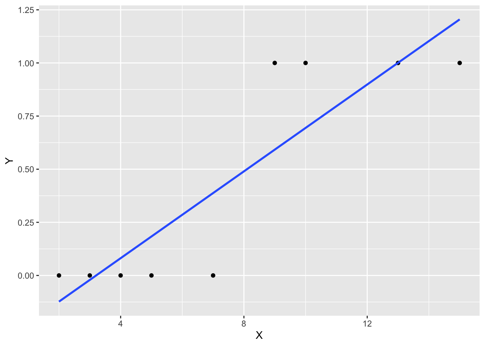
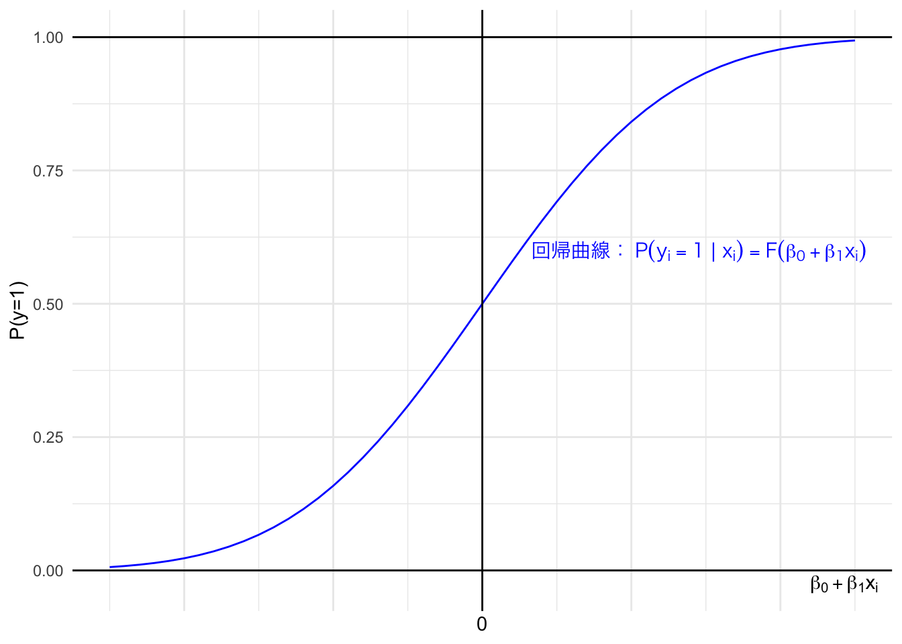

# 消費者の選択と離散選択モデル{#choice}

## 本章の概要

マーケティング施策の導入したり、戦術要素（例えば、4Ps）の変更はマーケティング意思決定において重要な問題である。その際、どのようにしてその変更によってどの程度消費者の需要が変化を分析、予測すればよいのだろうか？マーケティングリサーチでは伝統的に、「製品を購買したか否か」や、複数ある製品の候補から「どのブランドを選んだか」というような観察可能な選択行動についてのデータを収集、活用することで、上記の問いに答えてきた。

消費者の選択行動は例えば、ある製品を購買していれば 1 を、していなければ 0 を取るような離散データとして扱われる。マーケティングリサーチでは、このようなデータに対して「購入をした人は何%か？」というような円グラフを描くだけではなく、消費者の選択行動を被説明変数、マーケティング戦術要素などを説明変数とする分析モデルを構築し分析する。このような分析モデルは離散選択モデルと呼ばれ、マーケティングのみならず、交通や都市計画分野などにおいても頻繁に用いられている。

Rでは、プロビットモデルやロジットモデルを実行するための関数を用いてこれらの分析が可能である。しかしながら、分析の実行が容易であることに反して、これらの分析を適切に実行し、結果を解釈するためにはモデルの理論的前提についても注意が必要である。そのため本章では、主に4つの内容を強調する形で説明を行う。

第一に、離散選択モデルに基づき消費者行動を研究するための理論的枠組みを紹介する。本章で扱うアプローチでは、消費者の選択という観察可能な行動に着目しつつ、観察できない消費者の思考については、理論によって補完するという方法を取る。したがって、離散選択モデルに基づく含意を得るためには、その背後に存在する理論的枠組みに対する理解が必要になる。そこで本章では、消費者の選好に関する理論（顕示選好）と効用最大化との関係について説明する。

第二に、離散変数を被説明変数とする回帰モデルを最小二乗法で推定する場合について説明する。このような方法は線形確率モデルと呼ばれ、変数間の関係を検証することに着目する際には意図的に採用されることもある。線形確率モデルによって推定された係数は、説明変数が変化したときに被説明変数（ダミー変数）が1を取る確率（反応確率）が、どのように変化するかを示す。しかしながら線形確率モデルの最も大きな問題として、推定結果に基づく予測値が論理的整合性を満たさないというものがある。具体的には、線形確率モデルによって推定された予測値は反応確率を示しているはずであるにも関わらず、予測値が1を上回ったり、負の値を取ることがある。そのため、予測を重視する研究を行う場合や、効果の程度や推定値についての議論が重要である場合には線形確率モデルは適さない。

第三に、線形確率モデルではない推定方法としてプロビットモデルとロジットモデルを紹介する。本章では主にプロビットモデルを中心に説明を行っているが、どちらのアプローチでも非線形の（回帰直線ではなく、回帰曲線を引く）分析を行うことで、推定結果に基づいて計算される反応確率が 0 から 1 の範囲を越えないように調整される。この統計的なモデルの定式化について説明する。その後、潜在変数アプローチと呼ばれる、観察可能な離散変数の背後に観察できない連続的な変数が存在するという視点に基づく定式化を紹介する。マーケティングにおける研究群では、多様な背景を持った研究者が論文を書いているため、同じ離散選択モデルを用いた論文でもその定式化の説明方法が異なる場合がある。その際の手助けになるように、本章では上記の二つの異なる定式化アプローチを紹介する。その後、最尤法を用いてプロビットモデルを推定する方法を紹介する。ここではRでの分析実行方法と結果の解釈についても組み合わせて説明する。

ここまでの内容で、消費者の選択を巡る理論と、統計的な離散選択モデルを説明した。これらの内容を踏まえ、第四に離散選択モデルの消費者理論への応用について説明する。具体的には効用最大化という理論枠組みから効用関数の構造についてモデル化し、それを分析する手順や考え方について説明する。効用の大小関係に基づきプロビットやロジットモデルといった離散選択モデルを定式化する考え方自体は照井・佐藤（2022）などのマーケティングリサーチのテキストでも紹介されている。しかし本書には、これらの議論を巡る理論や統計的モデルについて順を追って確認する点に特徴がある。これにより、効用最大化を前提として用いられる選択モデルがなぜ、どのように定式化されるのかを理解することにつながることを期待している。

本章後半には、選択肢が三つ以上の場合の選択モデルとして、多項ロジットモデルの概要とRを用いた分析方法も追加的にを紹介している。また、最後には離散選択モデルの推定から実務的含意を得るための具体例も紹介しているため、こちらも合わせて確認してほしい。


## 消費者選択と合理的消費者像概観{#rational}
本章で扱う離散選択モデルは、消費者の観察可能な行動に着目し、消費者の選択行動などをモデル化することでその選択行動を定量的に分析、予測を行うことを目的としたアプローチである。消費者がなぜ特定の製品を買ったのか、どのような思考プロセスを経て購買に至ったのか、という頭のなかで起きている潜在的な心理プロセスは観察できないため、分析対象を「観察可能」な顕在的行動に限定し、分析を行う。しかしながら、このようなアプローチにおいても「消費者が何を考えているのか」という問いを無視しているわけではない。離散選択モデルにおいては主に経済学における理論に依拠することで、観察可能な行動に着目することの正当性を確保している。

離散選択モデルが依拠する理論的枠組みにおいて消費者は「合理的な行動」をとる人として捉えられている。ここにおける合理的な行動とは、自身の効用を最大にする行動と言える。このような前提に対し「消費者が自分の望む欲求の強さを測って効用として表すと想定するのは現実的ではない」や「仮に効用を測れたとしても、いちいち買い物をする際に効用の最大化計算なんて行っていない」といった反論を考えるかもしれない。実際にこのような批判が一部のマーケティングや消費者行動関連のテキストに記載されることもある。しかしながら、このような批判は誤解であり、離散選択モデルにおける合理的消費者像は、このような指摘が想定しているものとは異なる。本節では、理論を直感的に概観することで、合理的な消費者を想定することの背後にある理論的根拠について学ぶ。


ここでいう合理的な消費者とは、「自分が何を望んでいるのかをわかっていて、かつ利用できる機会を最大限に活用する個人」を指す。言い換えると、合理的とは自身の目的に沿った行動を取る個人を表す。つまり合理的な消費者とは、自身の満たすべき欲求がわかっており商品についてその欲求をどれだけ満たすかを表す尺度としての効用から考えることができる消費者と言い換えることができる。そのため、消費者は欲求を満たすという目的を実現するように（つまり効用を最大にするように）購買を行うと考える。また効用最大化については、本アプローチが想定する理論では、必ずしも消費者自身が購買において効用最大化問題を解いていることを意味しない。効用最大化の仮定は、消費者の選択がある一定の仮定を満たす場合、その行動について「あたかも」効用を最大化するように決めたものとして、研究者が分析、再現、予測することが可能であるという理論に依拠している。本節では、この理論的枠組みの直感的について説明する。

効用について理解するためには消費者の選好についての議論を整理することが重要になる。選好とは、与えられた選択肢に対してどちらが自身にとって好ましいかを表すものである。
ここで、ある選択対象 $x,y$ をもとに、選好関係の表記方法について整理する。任意の選択対象に対する選好関係は通常「$\succsim$, $\sim$, $\succ$」といった記号で表される^[記号$\succ$は、不等号を表す記号「$>$」とは異なることに注意すること。]。まず、「$x\succsim y$」は「$x$ は $y$ よりも同等以上に好ましい（弱く選好する）」ことを表す。次に、$x\succsim y$ と $y\succsim x$ の両方が成り立つとき、「$x\sim y$」として「$x$ は $y$ と同じぐらい好ましい（無差別である）」ことを表す。そして、$x\succsim y$ だが、$y\succsim x$ではないとき、「$x\succ y$」として「 $x$ は $y$ よりも厳密に好ましい（強く選好する）」ことを表す。

 表 \@ref(tab:preftable)は、消費者の弱選好（$x\succsim y$）、無差別（$x\sim y$）、強選好（$x\succ y$）の間の関係を表したものである。$x\succsim y$ と $y\succsim x$ の両方が成り立つ時、$x$ と $y$ は無差別であると言える。しかしながら、$x\succsim y$（$y\succsim x$）は成り立つが、$y\succsim x$（$x\succsim y$）は成り立たない場合、$y$（$x$）よりも厳密に $x$（$y$）を好むといえる。また、ここではどちらの弱選好も成り立たないような状況は排除して考える。


Table: (\#tab:preftable)選好関係

| $x\succsim y$ | $y\succsim x$ |     選好関係     |
|:-------------:|:-------------:|:----------------:|
|   成り立つ    |   成り立つ    |    $x\sim y$     |
|   成り立つ    | 成り立たない  |    $x\succ y$    |
| 成り立たない  |   成り立つ    |    $y\succ x$    |
| 成り立たない  | 成り立たない  | このケースは排除 |

このような表記を行う選好に関する議論は様々な個人の好みを許容するものであるが、「完備性」と「推移性」という首尾一貫性に関する性質を満たすと仮定する。完備性とは、どんな選択対象 $x,y$ についても、$x\succsim y$もしくは $y\succsim x$ の少なくとも一方が成り立つことである。つまり、表\@ref(tab:preftable) にもあるように$x \succsim y$ と $y \succsim x$ の両方が成り立たないというケースを排除しており、これは「$x,y$ のいずれが好ましいかの判断ができない」ということを排除しているものであると理解できる。
一方で推移性とは、選択対象 $x,y,z$ について、$x\succsim y$ かつ $y\succsim z$ ならば $x\succsim z$ が成り立つことを意味している。

選好に関するこれらの性質について例を用いて考えてみる。例えば、コーラとコーヒーがある場合、必ずどちらが好ましいか一方を選べるというのが完備性である。また、ここで、コーラとコーヒーという選択肢にお茶が加わった場合を考える。コーラとコーヒーを比べてコーラの方が好ましく、かつコーヒーとお茶を比べてコーヒーの方が好ましいと考えている消費者は、コーラとお茶を比べた場合、やはりコーラの方が好ましいと考えるだろう。このように一貫した順位が成立することが推移性である。これらの首尾一貫性が成立しているとはつまり、選択対象すべてを一番良いものから一番悪いものまで順番に並べることができるということを意味する。

ここまでの議論に基づき合理的行動を説明すると、「首尾一貫した好みの下、自身にとって最も望ましいものを常に選択することである」と言える。しかしながら、より分析上扱いやすい形でこの関係を表すためには、どちらが好きかではなく、数量的な大小関係で表すことができた方が便利である。そこで、選好関係に整合的な「効用」という値を割り当てることで見やすく表現する。このとき、選好関係と整合的な効用を割り当てるために用いられる関数が「効用関数」である。

効用と効用関数の関係においては、それぞれの選択対象 $x$ に、効用値 $u(x)$ を、「より好ましいものほど大きな数値を持つように」割り当てる。つまり、$x\succsim y$ ならば、$u(x)\geq u(y)$ となる $u(\cdot)$ を割り当てる。このように選好に整合的な効用を割り当てるためのルールを「効用関数」と呼ぶ。ここで重要になるのは、効用の値自体は選好関係と整合的であれば良く、表現される数値そのものは特に重視しないということである。例えば先程のように $x\succsim y$ という選好関係を効用で表す場合、$u(x)=10$ かつ $u(y)=1$ でも、$u(x)=1000$ かつ $u(y)=500$ でもどちらでも構わない。つまり、どの値を使っても選好関係と結論が変わらないように効用関数を用いることが重要になる。消費者の脳内の効用（満足）の大きさは測れないため、効用自体の絶対的な大きさには意味がなく、効用とはあくまでどちらが好きかを表す工夫と考える。このような考え方に基づく効用関数を「序数的効用関数」という^[有限な選択肢における選好関係が完備性と推移性を満たす場合なら序数的効用関数で表現できる。選択肢の数が有限でない場合の問題について、これらを議論したり数学的証明を与えるのは、本書のレベルを超える上に目的からも外れるので、扱わない。]。

このように、効用関数を用いて選好関係を効用の大小関係で表現する事によって、消費者の合理的行動は「自身の効用を最大化する行動」と説明することができる。先程の選好関係に基づく合理的行動の定義と比べるとだいぶ簡潔な定義になっただろう。ミクロ経済学やマーケティングの講義、テキストなどで紹介される「自身の効用を最大にする」という言葉の背景には、このように消費者の選好との密接な関係がある。

ここまでの説明を踏まえて改めて、「自身の効用なんて数値化できない！」「いちいち効用の計算をして、大小関係を比較することを考えて選択していない！」という批判に立ち戻りたい。先述の通り、このアプローチにおける合理的消費者像は、決して人間が毎回効用最大化計算を行って行動を決定していると主張しているわけではない。ここで想定している合理的消費者像は、ある規則性を満たすならば（本当の頭の中はどうあれ）、「<u>あたかも</u>」効用最大化を行った結果であるとみなすことができるというものである。つまり、合理性は選択を行う消費者自身ではなく、選択を理解しようとする（観察者や研究者などの）第三者がそのように捉えるということを表している。

このような合理的消費者像を正当化するためにはある仮定を満たす必要がある。具体的には、消費者の選択行動はセンの$\alpha$条件と呼ばれる性質を満たす必要がある^[ただし、ここでは議論を簡単にするために、ある選択肢の中から1つを選択するということを仮定している。この仮定を緩めて、「$\{x,y,z\}$ なら $x$ か $y$ のいずれかを選ぶ」という選択も許した場合に議論を拡張するには、センの$\beta$ 条件と呼ばれる追加的な条件が必要になる。$\beta$ 条件は、集合 $A$ とその任意の部分集合 $B$ に対して、$B$ において複数の選択肢（$x,y$）が選ばれる時、もし集合 $A$ からの選択において $x$ が選ばれるならば、$y$ も選ばれるという性質である。この $\beta$ 条件は、例えば「神戸市にある全ての居酒屋の中から一番好きな店を教えて」と言われて甲乙つけ難い飲み屋が2店（$x$ と $y$ とする）選ばれた場合、「
兵庫県にある全ての飲み屋の中から一番好きな店を教えて」と聞かれてその人が $x$ と答えるならば、やはり $y$ も兵庫県のベストとして選ばれることになるということを表している。]。$\alpha$ 条件は、選択対象になりうる集合 $A$ と、$A$ のどのような部分集合 $B$ に対しても、$A$ から選択される選択肢 $x$ が $B$ に含まれているならば、その部分集合である $B$ から選択されるものもまた$x$であるというような性質である。例えば、「兵庫県にある全ての居酒屋の中から一番好きな店を教えて」と言われた際に選ばれるお店が神戸市にあるならば、「神戸市にある全ての居酒屋の中から一番好きな店を教えて」言われて選ばれるお店も同じものである、ということを表している。

消費者の選択行動がこの条件を満たすことと、これを満たすような選択行動が完備性と推移性を満たす選好として合理化可能であることは同値であるということが知られている。つまり、このような性質を満たす選択行動に対しては、実際に消費者の頭のなかで何が起きているかに関わらず、効用最大化行動としてその消費者の行動を再現（観察・分析・予測）できると考えることができる。このような考え方は、顕示選好として知られている。そして、このような考え方の妥当性は顕示選好定理という数学的命題として示されているが、その詳細や証明についてはここでは取り扱わない。

## 選択行動と効用最大化{#utility}
本節では、消費者の選択行動と効用最大化との関係について具体例を用いて説明する。ある消費者の行動例に焦点を合わせ、どのような消費者が分析可能な考察対象になるのかを説明し、次にその消費者の選択をあたかも効用最大化で表現できることを紹介する。

### Step 1: どのような消費者を考察の対象にするのか


経済学において対象となる消費者像を捉えるために、東京都で居酒屋に行こうとしているある人物の選択を取り上げてみる。今、この人が行こうとしている居酒屋の候補は3件あると仮定し、その店をそれぞれ $x,y,z$ と表す。この人は選択肢 $\{x,y,z\}$ の中から、$x$を選択しようとしているとする^[この選択を$y$や$z$に変えても、以下の議論は同様に成り立つ。]。
ここで、この人が居酒屋 $z$ が定休日だったことを思い出したとする。
このとき選択肢は $\{x,y,z\}$ から $\{x,y\}$ へと変化するが、彼は選択肢 $\{x,y\}$ のうちいずれを選択するだろうか？おそらく $x$ を選択するのが自然だろうと考えられる^[これが自然だと言いきれるかどうかについては議論の余地もあるが、言い換えると、このような状況を満たす選択がこのアプローチに基づく分析の対象だといえる。]。この場合、この人物の選択はセンの $\alpha$ 条件を満たすと仮定することができる。

一方で、この人が選択肢 $\{y,z\}$ に直面したときには居酒屋 $y$ を選択したとする。
このとき、センの $\alpha$ 条件から、彼が様々な選択肢に直面したときの選択が、次の表のように観察もしくは予測できることになる。
表の中で $\hat{x}$ で示されている部分は、$\alpha$条件から導かれる予測選択である。


Table: (\#tab:sensalpha)$\alpha$条件を満たす選択

|  選択肢   | 選択結果  |
|:---------:|:---------:|
| {$x,y,z$} |    $x$    |
|  {$x,y$}  | $\hat{x}$ |
|  {$y,z$}  |    $y$    |
|  {$x,z$}  | $\hat{x}$ |


### Step 2: 選好モデルと効用
本節では、先述の消費者に関する選好関係に対応する効用についての議論を紹介する。なおここでは、単純化のために2つの選択肢からの選択結果に注目する。ある消費者の2つの選択肢からの選択が以下のような結果であったとする。

- $\{x,y\}$ からは $x$
- $\{y,z\}$ からは $y$
- $\{x,z\}$ からは $x$

したがって、この人は $x$ と $y$ との比較では $x$ 好むと解釈でき、$x \succ y$と表すことができる。つまり、2つの選択肢からの選択結果という情報から、この消費者の選好を導き出すことが可能である。その他の選択肢への結果も踏まえると、$x$、$y$、$z$ に対するこの消費者の選好関係は $x \succ y \succ z$であり、この人は「$x$ を1番目、$y$ を2番目、$z$ を3番目に選好する」消費者だと理解できる。

これらの結果から、この人はどのような2つの選択肢に対しても、いずれが好ましいかを判断できており^[完備性が成り立っているといえる。この完備性の成立には、Step1において明示的には述べなかった「選択肢が与えられたときにどれかを選んでいる」という仮定によって満たされている。]、選択肢を好きな順番に1列に並べることができている ^[推移性が成り立っているといえる。この「1列に並べることができる」という性質は、Step 1における $\alpha$ 条件が成り立つという仮定に依存していることに注意して欲しい。Step 1で登場した $\alpha$ 条件が成り立たず、$\{x,z\}$ からは$z$を選択するとしよう。このとき、$x \succ y$、$y \succ z$ であるが $z \succ x$ となってしまい、"$x \succ y \succ z \succ x...$" という形でサイクルが起こってしまう。]。

Step 2の最後に、この選好順序を数値の大小で表現する。
ここで、効用の値自体は選好関係に整合的であれば良いので、数字の当てはめ方は特に問題にならない。ここでは仮に、この人の選好関係「$x \succ y \succ z$」を、効用関数「$u(x)=6,u(y)=2,u(z)=1$」で表すことにする^[繰り返しになるが、数値の大小は選好する順番だけを表現したものであって、たとえば "$y$は$z$の2倍の効用を得るが、$x$だったら6倍である" などということは意味しない。これ以外にも、たとえば「$u(x)=2,u(y)=1,u(z)=0$」という効用関数を用いても、同じ選好関係を表現できている。]。

### Step 3: 効用最大化
Step 2で効用関数の考え方を導入したが、効用を最大にするというプロセスがどのように選択行動と関係するか確認する。合理的意思決定で論じられる「自身の効用を最大にする行動」について、Step 2で導入した効用関数「$u(x)=6,u(y)=2,u(z)=1$」のもとで考える。

この効用関数を持つ人が、たとえば$\{x,y\}$という2つの選択肢から選択しなければならないとき、効用を最大にする選択肢は、$u(x)=6>2=u(y)$なので、$x$である。
あるいは、$\{x,y,z\}$という3つの選択肢から選択しなければならないとき、効用を最大にする選択肢は、$u(x)=6>2=u(y)$および$u(x)=6>1=u(z)$なので、$x$である。
このように、選択肢が与えられたときに、効用の大小比較を行って効用を最大にする選択肢を調べた結果が表\@ref(tab:umax) である。


Table: (\#tab:umax)効用最大化による選択再現結果

|  選択肢   | 効用を最大にする選択 |
|:---------:|:--------------------:|
| {$x,y,z$} |         $x$          |
|  {$x,y$}  |         $x$          |
|  {$y,z$}  |         $y$          |
|  {$x,z$}  |         $x$          |

表\@ref(tab:sensalpha)と表\@ref(tab:umax)  を比較すると、「選択結果」と「効用を最大にする選択」が一致していることが確認できる。つまり、$\alpha$ 条件を満たす人物の選択行動を、効用最大化というルールで再現することができた。本アプローチは、消費者の頭の中でなにが起こっているのかについて理解するのは困難であるため、実際に何を選んでいるのかという行動に着目し、効用最大化から消費者の行動を再現するというアプローチを取っている。

このような理論的な議論は、消費者の行動を分析するための重要な示唆を与える。消費者による「首尾一貫した選択を分析の対象とする」という仮定を置くことで、消費者の選択行動結果に基づき、本来観察できない選択肢の効用を推察できるようになる。例えば、消費者のある選択肢に対する選択結果と各選択肢の属性（価格など）に関する情報は観察可能である。これらの観察可能な情報に基づき分析を行うことで、選択肢の持つ属性が効用、ひいては選択肢の選択確率にどのような影響を与えるかを定量的に明らかにすることができる。

## 離散選択モデル{#discrete}

### 線形確率モデル
前節末で説明したような、選択肢の持つ属性によって消費者の選択行動がどのように変化するかを、統計的に分析・説明するためには、被説明変数に選択結果をとり、説明変数に選択肢属性を取る以下のような回帰モデルを考える。なお、簡単化のために単回帰モデルで本アプローチを紹介しているが、以下の議論は任意の $k$ 個の説明変数を含む重回帰モデルに応用することができる。

$$
y_i=\beta_0+\beta_1x_i+e_i,
$$
ただし、$y$ は特定の製品を購入したか（$y_i=1$）、購入していないか（$y_i=0$）を表しており、$x_i$ は価格を表しているとする。分析においては $y_i$ と $x_i$についての情報を含むデータセットを用いて、パラメータ $\beta_0$ と $\beta_1$ を推定する。通常、（他の要素が一定である場合）価格が上がると製品を購入（選択）する確率は下がると考えられるので、$\beta_1<0$ が予測される。

このように消費者の選択を捉えた分析においては、被説明変数がダミー変数である回帰モデルを考える必要がある。しかしながら、ダミー変数のような離散変数を被説明変数に用いる場合には注意も必要である。本章では、このようなモデルを最小二乗法（OLS）で推定するアプローチとその際に生じる注意点を説明したうえで、それを克服するために用いられる分析手法を紹介する。

被説明変数がダミー変数であるOLS回帰モデルは線形確率モデル（Linear Probability Model: LPM）と呼ばれる。ただし、$y$ が2値しか取らないため、$\beta_1$ は、「$x_i$ が1単位変化した際の $y$ の変化」として解釈することはできない。

ここで、誤差項の条件付き期待値について 0 であるという仮定（$E(e_i|x_i)=0$）に基づくと、$y_i$ の条件付き期待値について以下を得る。

$$
E(y_i|x_i)=\beta_0+\beta_1x_i
$$

ここで、$y$ は 0 か 1 を取るダミー変数なので、$P(y_i = 1|x_i)= E(y_i|x_i)$ と示すことができる（Wooldridge, 2003）。したがってLPMでは、以下のように線形モデル化したものだと理解できる。
$$
P(y_i = 1|x_i)=\beta_0+\beta_1x_i
$$

このとき、$P(y_i = 1|x_i)$ は反応確率（response probability）や成功確率（probability of success）と呼ばれる。また、確率の合計は 1 になるため、$P(y_i = 0|x_i)=1-P(y_i = 1|x_i)$ もまた $x_i$ に関する線形の関数になる。LPMにおいて定数項（$\beta_0$）は $x$ が0のときの反応確率を表しており、傾きの係数 $\beta_1$ は $x_i$ の変化に伴う反応確率の変化を表していると解釈できる。より具体的には、$\beta_1$ は以下のように表現できる。

$$
\Delta P(y_i = 1|x_i)=\Delta\beta_1x_i
$$

このことから、$y$ の予測値（$\hat{y_i} = \hat{\beta}_0+\hat{\beta}_1x_i$）も線形回帰モデルと同様に示すことができる。したがって、係数の解釈について注意が必要ではあるものの、LPMによる推定結果も線形回帰モデル同様の含意を提供する。特に、複数の説明変数を採用することで、他の変数を固定したうえで説明変数の変化に伴う反応確率の変化を捉えることができる。そのため、LPMによって着目する変数が反応確率へ与える影響を検証することができる。

しかしながら、LPMの推定結果には注意も必要である。具体的には、以下の2点について問題が生じる。

1. 誤差項の分散が不均一になる。
2. 予測値が論理的整合性を満たさなくなる。

第一の問題点については、LPMで推定してしまうことで、OLS推定量が好ましい性質を持つための仮定（均一分散）を満たさないことにつながる。分散が均一であるとは、誤差項の分散がどの観測個体 $i$ に対しても同じ大きさであることを指す。そのため、特定の主体だけ誤差項の分散が大きい場合や、$x$ の値の変化に伴って誤差項の分散が大きくなるような状態ではこの仮定は満たされず、分散不均一であると言われる。

ここで、上記のモデルの誤差項は $e_i= y_i - (\beta_0+\beta_1x_i)$ である。ここで、$y_i$ の条件付き期待値を $P_i=E(y_i|x_i)=P(y_i = 1|x_i)=\beta_0+\beta_1x_i$ と定義すると、誤差項の分散は $Var(e_i|x_i)=P_i(1-P_i)$ となることが知られている（西山ほか,2019）。$P_i$ の大きさはその定義より各主体によって $x_i$ に依存する形で変化することが伺える。そのため、LPMによる推定では、分散不均一の問題が生じるといえる。しかしながらこの問題は通常、分散不均一に対して頑健な標準誤差（例えば、ホワイトの標準誤差）を用いた分析を用いることで対応される。

第二に予測値の論理的整合性について説明する。LPM推定によって得た $y$ の予測値は、反応確率の予測値を表すため、 $y$ の予測値は 0 から 1 の間に収まらないといけない。しかし、LPMでは予測値が負の値を取ったり、1 を上回ることもある。言い換えると確率の定義に反するような、論理的に整合的ではない予測値を返してしまう。ここで、以下のような簡単な人工データを用いて、LPMによる分析を実行してみる。下記df1の成果変数（Y）はダミー変数であり、説明変数（X）は連続変数だとする。これを線形モデルで回帰し、予測値を出力してみる。すると、1つ目と4つ目の観測は負の値、7つ目と8つ目の観測は1を越える予測値を得たことが伺える。


``` r
df1 <- data.frame(Y = c(0, 0, 0, 0, 0, 1, 1, 1, 1),
                  X = c(3.4, 5.22, 7.06, 2.81, 4.11, 10.34, 13.67, 15.99, 9.09))
lpm1 <- lm(Y ~ X, data = df1)
pred_lpm1 <- predict(lpm1)
pred_lpm1 
```

```
##            1            2            3            4            5            6 
## -0.006342894  0.173357681  0.355032986 -0.064597476  0.063760077  0.678888967 
##            7            8            9 
##  1.007681776  1.236750640  0.555468243
```

図 \@ref(fig:lpm-plot)  は、このデータのプロットとLPMで推定した際の回帰直線との関係の例を示している。この結果からも、いくつかの観測主体によって確率の範囲を越えた予測値を得ていることが伺える。
<div class="figure">

<p class="caption">(\#fig:lpm-plot)LPM と回帰直線</p>
</div>


そのため、予測を重視する研究を行う場合には、LPMは適さないことが多い。その一方で変数間の関係を検証することを目的とする場合には、大きな問題にはならないと考える場合もある（Angrist and Pischke, 2014）。言い換えると、ある説明変数が選択確率に与える影響を統計的に検証するという目的のもとでは、LPMでも対応可能である。操作変数法や固定効果推定といった発展的な手法が線形モデルでは開発されており、LPMではこれらの手法を応用することができることもこの考え方に影響を与えている。


### プロビットモデルとロジットモデル*
任意の $k$ 個の説明変数を用いたLPMの反応確率は、
$$
P_i=E(y_i|x_{1i},...,x_{ki})=P(y_i = 1|x_{1i},...,x_{ki})=\beta_0+\beta_1x_{1i}+...+\beta_kx_{ki}
$$
となる。このモデルを分析するうえで線形確率モデル（LPM）が有する問題のひとつは、この確率が 0 から 1 の範囲を越えてしまう事にあった。この問題は、$y$（選択）と $x$（説明変数）との関係を線形で捉えることが原因となっている。そのため、0 から 1 の範囲を越えないように、何らかの累積分布関数を用いて非線形で分析を行う（回帰直線ではなく、回帰曲線を引く）ことで、この問題を克服する事ができる。

非線形なモデルとして分析する場合、回帰モデルによる反応確率は以下のように示すことができる。

$$
P(y_i = 1|x_{1i},...,x_{ki})=F\left(\beta_0+\beta_1x_i+...+\beta_kx_{ki}\right)
$$
ただし、$F(\cdot)$は選択（反応確率）と説明変数を非線形な形で結びつけるためのなんらかの関数である。ここで採用する$F(\cdot)$によって回帰曲線の形状が決まる。

例えば、図 \@ref(fig:norm-cdf)は図\@ref(fig:lpm-plot)との対比として（説明変数が一つのモデルを）非線形でのモデル化を示したものである。図 \@ref(fig:norm-cdf)のように、非線形の近似曲線で回帰分析を行うことで、確率を意味する予測値が0から1の範囲に収まる。

<div class="figure">

<p class="caption">(\#fig:norm-cdf)非線形での近似イメージ</p>
</div>

このときに用いる関数形として一般的なものが、標準正規分布の累積分布関数である。累積分布関数は、確率密度関数を積分していくことで得ることができ、0 を下限、1 を上限とする分布である。
<!-- 図\@ref(fig:norm) は標準正規分布の確率密度関数（下）と累積分布関数（上）の関係を示したものである。 -->

<!-- ```{r norm,fig.cap="反応確率と標準正規分布", echo=FALSE,message=FALSE,warning=FALSE} -->
<!-- library(patchwork) -->
<!-- x.value <- seq(-3, 3, 0.1) -->
<!-- dens <- ggplot(NULL, aes(x = x.value, y = dnorm(x.value, mean = 0, sd = 1))) + -->
<!--   geom_line() + geom_vline(xintercept = -1, color = "blue") + -->
<!--    guides(x = "none", y = "none") + labs(x = "", y = expression(P(y[i] == 1))) + -->
<!--   annotate("text", x = -0.9, y = 0.05,  -->
<!--            label = expression(P(y[i] == 1 ~ "|" ~ x[1*i] * "," ~ ... * "," ~ x[k*i])), -->
<!--            hjust = 0, -->
<!--            color = "blue") + -->
<!--   theme_minimal() -->

<!-- cum <- ggplot(NULL, aes(x = x.value, y = pnorm(x.value, mean = 0, sd = 1))) + -->
<!--   geom_line() + geom_vline(xintercept = -1,color = "blue") + -->
<!--    guides(x = "none", y = "none") +  -->
<!--   labs(x = "", y = expression(P(y[i] == 1))) + -->
<!--   theme_minimal() -->

<!-- # 上下に併記する -->
<!-- combined_plot <-  cum/dens -->

<!-- # プロットを表示 -->
<!-- print(combined_plot) -->

<!-- ``` -->


標準正規分布の累積分布関数を$\Phi$（ファイ）で示すと、反応確率は以下のように表すことができる^[ただし、$\Phi'(z)=\phi(z)=\frac{1}{\sqrt{2\pi}}\exp(\frac{-z^2}{2})$とする。]。

$$
P(y_i=1|x_{1i},...,x_{ki})=\Phi(\beta_0+\beta_1x_{1i}+...+\beta_kx_{ki})=\int^{\beta_0+\sum^k_{j =1}\beta_jx_{ji}}_{-\infty}\phi(z)~dz
$$

一方で、$P(y_i=0|x_{1i},...,x_{ki})$については、以下が成り立つ。
$$
P(y_i=0|x_{1i},...,x_{ki})=1-P(y_i=1|x_{1i},...,x_{ki})=1-\Phi(\beta_0+\beta_1x_{1i}+...+\beta_kx_{ki})
$$
これにより、選択肢を選ぶことへの条件付き確率と選ばないことへの条件付き確率を、回帰モデルと標準正規分布の累積分布関数との関係から定義する事ができた。これを $y_i=1$ か $y_i=0$ という値を取る事象に対応させるため、ベルヌーイ確率関数^[$f(y_i)=P_i^{y_i}\times\big(1-P_i)^{1-y_i}$]に代入すると、以下のような確率密度関数を考えることができる。


\begin{equation}
P(y_i|x_{1i},...,x_{ki})=\\
\Big(\Phi(\beta_0+\beta_1x_{1i}+...+\beta_kx_{ki}) \Big)^{y_i}\times \Big(1-\Phi(\beta_0+\beta_1x_{1i}+...+\beta_kx_{ki}) \Big)^{1-y_i} (\#eq:probit)
\end{equation}

このように、選択行動に対して標準正規分布の累積分布関数を仮定して定式化するモデルを「プロビットモデル」と呼ぶ。また、選択モデルでは標準正規分布ではなく、ロジスティック分布の累積分布関数を用いた定式化を行う「ロジットモデル」を用いることも多い。ロジットモデルでは、ロジスティック分布の累積分布関数（$\Lambda(\beta_0+\beta_1x_{1i}+...+\beta_kx_{ki})$）を用いて、以下のような密度関数を用いる。

$$
P(y_i|x_{1i},...,x_{ki}) =\Lambda(\beta_0+\beta_1x_{1i}+...+\beta_kx_{ki})=\frac{\exp(\beta_0+\beta_1x_{1i}+...+\beta_kx_{ki})}{1+\exp(\beta_0+\beta_1x_{1i}+...+\beta_kx_{ki})}
$$

ロジットモデルでは、回帰モデル（$\beta_0+\beta_1x_{1i}+...+\beta_kx_{ki}$）の値が大きくなると反応確率が 1 に近づき、小さくなると 0 に近づくという性質を持っており、取りうる区間も 0 から 1 の間に限定されている。この点において、ロジットモデルはプロビットモデルと同様の特徴を持っている。そのうえでロジットモデルは分析における数値計算がプロビットモデルよりも容易であり、これまで広く使われてきたという経緯がある。コンピュータの性能が高まった近年ではプロビットモデルの使用が増えてきたものの、過去の研究との比較やこれまでの研究蓄積、慣習と言った側面を重視し、引き続きロジットモデルが使われることも多い。

### 潜在変数アプローチによる説明*

これまでは、「選択」という点に着目し、ベルヌーイ確率関数を用いてプロビットモデルを導出する方法を紹介した。一方で、選択という離散的な変数の背後に、観察できない連続的な変数（潜在変数:
latent variable）が存在するという視点からモデル化を行うことも可能である。このような考え方を潜在変数アプローチと呼ぶ。マーケティング領域の論文やテキストでは、この潜在変数アプローチに基づく選択モデルの記述や紹介も行われるため、本書では、先述のプロビットモデルと潜在変数アプローチにより導出されたモデルが一致することを示す。

ここで、$y_i^*$ という（観察可能な説明変数とは異なる）連続的な潜在変数を考え、以下のような回帰モデルを考える。

$$
y_i^*=\beta_0+\beta_1x_{1i}+...+\beta_kx_{ki}+e_i
$$

ただし、この誤差項 $e_i$ は標準正規分布に従い、$e_i|x_{1i},...,x_{ki}~\sim N(0,1)$を満たすと考える。

この時、$y_i^*$ がある閾値を越えたならば（観察可能な）被説明変数は 1 をとり、越えない場合は被説明変数が 0 をとる、というような潜在変数と被説明変数との関係を考える。プロビットモデルでは具体的に、以下のような関係を仮定する。

$$
\begin{aligned}
y_i=
\left\{
\begin{array}{ll}
0 & ~\text{if}~~y_i^*\leq0 \\
1 &  ~\text{if}~~y_i^*>0
\end{array}
\right.
\end{aligned}
$$

そのため、$P(y_i=1|x_{1i},...,x_{ki})=P(y_i^*>0|x_{1i},...,x_{ki})$や、$P(y_i=0|x_{1i},...,x_{ki})=P(y_i^*\leq0|x_{1i},...,x_{ki})$ と示せることがわかる。この性質を利用して、選択しないことへの条件付き確率 $P(y_i=0|x_{1i},...,x_{ki})$ は以下のように標準正規分布の累積分布関数を用いて表現できる（西山ほか, 2019, p.339）。

$$
\begin{align}
P(y_i=0|x_{1i},...,x_{ki})&=P(y_i^*\leq0|x_{1i},...,x_{ki})\\
&= P(\beta_0+\beta_1x_{1i}+...+\beta_kx_{ki}+e_i\leq0|x_{1i},...,x_{ki})\\
&=P(e_i\leq -\beta_0-\beta_1x_{1i}-...-\beta_kx_{ki}|x_{1i},...,x_{ki})\\
&=\Phi(-\beta_0-\beta_1x_{1i}-...-\beta_kx_{ki})
\end{align}
$$
標準正規分布はその性質より、0を中心として左右対称な確率密度関数を持つ。そのため、$e_i$ が $(-\beta_0-\beta_1x_{1i}-...-\beta_kx_{ki})$ 以下の値を取る確率と、$(\beta_0+\beta_1x_{1i}+...+\beta_kx_{ki})$ 以上の値を取る確率は等しくなるため、以下を得る。

$$
P(y_i=0|x_{1i},...,x_{ki})=1-\Phi(\beta_0+\beta_1x_{1i}+...+\beta_kx_{ki})
$$
また、$P(y_i=1|x_{1i},...,x_{ki})=1-P(y_i=0|x_{1i},...,x_{ki})$ であるため、反応確率は以下のように示すことができる。

$$
P(y_i=1|x_{1i},...,x_{ki})=\Phi(\beta_0+\beta_1x_{1i}+...+\beta_kx_{ki})
$$
したがって、潜在変数アプローチでも通常のプロビットモデルと一致するモデルを得ることができた。

<!-- メモ：mlogit packageのketchup dataがある -->
## プロビットモデルの推定と解釈
### 分析の実行と結果のまとめ

プロビットモデルを構築できたら、次はモデル内のパラメータに関する推定値（$\hat{\beta}_0, \hat{\beta}_1,...,\hat{\beta}_k$）を求め、選択確率に関する含意を得る。プロビットモデルのパラメータ推定においては、最小二乗法ではなく、最尤（Maximum Likelihood: ML）法を用いるが、詳細については補足（\@ref(ml)）を参照してほしい。


プロビットモデルを推定する場合のデータセットには、説明変数に関する列（$x_{1i},.., x_{ki}$）と、それに対応する個人 $i$ の選択結果 $y_i$（選択していれば1、選択していなければ 0）が記録されている。`choice_data.xlsx` は、二つの製品に対する消費者の選択結果を捉えた人工データセットである。データには製品1の価格 $p1$、製品2の価格 $p2$（千円）、製品1のクーポン広告を受け取ったかのダミー変数 $a1$、製品2のクーポン広告ダミー変数 $a2$ と、製品1の選択結果 $y1$、製品2の選択結果 $y2$ が含まれている。


``` r
choice_df <- readxl::read_xlsx("data/choice_data.xlsx")
head(choice_df)
```

```
## # A tibble: 6 × 6
##      y1    y2    p1    p2    a1    a2
##   <dbl> <dbl> <dbl> <dbl> <dbl> <dbl>
## 1     1     0 10.7  16.8      0     1
## 2     0     1 11.6   9.15     1     0
## 3     1     0  8.97  9.31     1     0
## 4     1     0  4.62  8.03     0     0
## 5     1     0  7.81 19.2      1     1
## 6     1     0  7.49  8.84     0     0
```

この`choice_data.xlsx`を用いて製品1の選択に関するプロビットモデルを推定してみる。Rでは`glm()`関数において、`family = binomial(link = probit)` という引数を指定することで実行が可能である^[ロジットモデルの場合は、`family = binomial(link = logit)` で計算可能である。]。以下では分析の実行と結果の出力を行う。


``` r
probit1 <- glm(y1 ~ p1 + a1, 
               family = binomial(link = probit),
               data = choice_df)
summary(probit1)
```

```
## 
## Call:
## glm(formula = y1 ~ p1 + a1, family = binomial(link = probit), 
##     data = choice_df)
## 
## Coefficients:
##             Estimate Std. Error z value Pr(>|z|)    
## (Intercept)  2.04117    0.22350   9.133  < 2e-16 ***
## p1          -0.24720    0.02213 -11.171  < 2e-16 ***
## a1           0.62763    0.08656   7.251 4.13e-13 ***
## ---
## Signif. codes:  0 '***' 0.001 '**' 0.01 '*' 0.05 '.' 0.1 ' ' 1
## 
## (Dispersion parameter for binomial family taken to be 1)
## 
##     Null deviance: 1384.5  on 999  degrees of freedom
## Residual deviance: 1205.5  on 997  degrees of freedom
## AIC: 1211.5
## 
## Number of Fisher Scoring iterations: 3
```

ここまで、我々は線形確率、プロビット、ロジットという3種類のモデルでの推定方法を概観してきた。以下では、これらの異なる推定方法を用いた分析結果を併記する。


``` r
library(modelsummary)
ols1 <- lm(y1 ~ p1 + a1, 
               data = choice_df)

logit1 <- glm(y1 ~ p1 + a1, 
               family = binomial(link = logit),
               data = choice_df)
models <- list() 
models[["Linear probability model"]] <- ols1
models[["Probit model"]] <- probit1
models[["Logit model"]] <- logit1

modelsummary(models, 
         title = "モデル比較",
         notes = "Values in [ ] show robust standard errors",
         stars = TRUE, 
         statistic = "std.error",
         vcov = "robust",
         gof_map = "nobs") #適合度指標において、サンプルサイズ（"nobs"）のみ表示するという指示
```

```{=html}
<!-- preamble start -->

    <script>

      function styleCell_c48yvf9sfom685onv1ro(i, j, css_id) {
          var table = document.getElementById("tinytable_c48yvf9sfom685onv1ro");
          var cell = table.rows[i]?.cells[j];  // Safe navigation to avoid errors
          if (cell) {
              console.log(`Styling cell at (${i}, ${j}) with class ${css_id}`);
              cell.classList.add(css_id);
          } else {
              console.warn(`Cell at (${i}, ${j}) not found.`);
          }
      }
      function insertSpanRow(i, colspan, content) {
        var table = document.getElementById('tinytable_c48yvf9sfom685onv1ro');
        var newRow = table.insertRow(i);
        var newCell = newRow.insertCell(0);
        newCell.setAttribute("colspan", colspan);
        // newCell.innerText = content;
        // this may be unsafe, but innerText does not interpret <br>
        newCell.innerHTML = content;
      }
      function spanCell_c48yvf9sfom685onv1ro(i, j, rowspan, colspan) {
        var table = document.getElementById("tinytable_c48yvf9sfom685onv1ro");
        const targetRow = table.rows[i];
        const targetCell = targetRow.cells[j];
        for (let r = 0; r < rowspan; r++) {
          // Only start deleting cells to the right for the first row (r == 0)
          if (r === 0) {
            // Delete cells to the right of the target cell in the first row
            for (let c = colspan - 1; c > 0; c--) {
              if (table.rows[i + r].cells[j + c]) {
                table.rows[i + r].deleteCell(j + c);
              }
            }
          }
          // For rows below the first, delete starting from the target column
          if (r > 0) {
            for (let c = colspan - 1; c >= 0; c--) {
              if (table.rows[i + r] && table.rows[i + r].cells[j]) {
                table.rows[i + r].deleteCell(j);
              }
            }
          }
        }
        // Set rowspan and colspan of the target cell
        targetCell.rowSpan = rowspan;
        targetCell.colSpan = colspan;
      }
      // tinytable span after
      window.addEventListener('load', function () {
          var cellsToStyle = [
            // tinytable style arrays after
          { positions: [ { i: 7, j: 1 }, { i: 7, j: 2 }, { i: 7, j: 3 },  ], css_id: 'tinytable_css_hxqw09n33mlz1cecwssu',}, 
          { positions: [ { i: 6, j: 1 }, { i: 6, j: 2 }, { i: 6, j: 3 },  ], css_id: 'tinytable_css_lilp84mt4zuv4r0rkz7g',}, 
          { positions: [ { i: 1, j: 1 }, { i: 2, j: 1 }, { i: 3, j: 1 }, { i: 5, j: 1 }, { i: 2, j: 2 }, { i: 3, j: 2 }, { i: 1, j: 2 }, { i: 2, j: 3 }, { i: 3, j: 3 }, { i: 4, j: 1 }, { i: 5, j: 2 }, { i: 4, j: 2 }, { i: 1, j: 3 }, { i: 4, j: 3 }, { i: 5, j: 3 },  ], css_id: 'tinytable_css_9jjtmntfhfnus74uptvk',}, 
          { positions: [ { i: 0, j: 1 }, { i: 0, j: 2 }, { i: 0, j: 3 },  ], css_id: 'tinytable_css_m1rlcjsmev6udl5acatq',}, 
          { positions: [ { i: 7, j: 0 },  ], css_id: 'tinytable_css_5ps97sdp5wab8o6tfxtk',}, 
          { positions: [ { i: 6, j: 0 },  ], css_id: 'tinytable_css_6a3pvlnrv0tpx4puk8oc',}, 
          { positions: [ { i: 1, j: 0 }, { i: 2, j: 0 }, { i: 3, j: 0 }, { i: 4, j: 0 }, { i: 5, j: 0 },  ], css_id: 'tinytable_css_qyxp76j8qwshgqcsx3zt',}, 
          { positions: [ { i: 0, j: 0 },  ], css_id: 'tinytable_css_od7o7337icg58j77q1t1',}, 
          ];

          // Loop over the arrays to style the cells
          cellsToStyle.forEach(function (group) {
              group.positions.forEach(function (cell) {
                  styleCell_c48yvf9sfom685onv1ro(cell.i, cell.j, group.css_id);
              });
          });
      });
    </script>

    <style>
      /* tinytable css entries after */
      .table td.tinytable_css_hxqw09n33mlz1cecwssu, .table th.tinytable_css_hxqw09n33mlz1cecwssu { text-align: center; border-bottom: solid #d3d8dc 0.1em; }
      .table td.tinytable_css_lilp84mt4zuv4r0rkz7g, .table th.tinytable_css_lilp84mt4zuv4r0rkz7g { text-align: center; border-bottom: solid black 0.05em; }
      .table td.tinytable_css_9jjtmntfhfnus74uptvk, .table th.tinytable_css_9jjtmntfhfnus74uptvk { text-align: center; }
      .table td.tinytable_css_m1rlcjsmev6udl5acatq, .table th.tinytable_css_m1rlcjsmev6udl5acatq { text-align: center; border-top: solid #d3d8dc 0.1em; border-bottom: solid #d3d8dc 0.05em; }
      .table td.tinytable_css_5ps97sdp5wab8o6tfxtk, .table th.tinytable_css_5ps97sdp5wab8o6tfxtk { text-align: left; border-bottom: solid #d3d8dc 0.1em; }
      .table td.tinytable_css_6a3pvlnrv0tpx4puk8oc, .table th.tinytable_css_6a3pvlnrv0tpx4puk8oc { text-align: left; border-bottom: solid black 0.05em; }
      .table td.tinytable_css_qyxp76j8qwshgqcsx3zt, .table th.tinytable_css_qyxp76j8qwshgqcsx3zt { text-align: left; }
      .table td.tinytable_css_od7o7337icg58j77q1t1, .table th.tinytable_css_od7o7337icg58j77q1t1 { text-align: left; border-top: solid #d3d8dc 0.1em; border-bottom: solid #d3d8dc 0.05em; }
    </style>
    <div class="container">
      <table class="table table-borderless" id="tinytable_c48yvf9sfom685onv1ro" style="width: auto; margin-left: auto; margin-right: auto;" data-quarto-disable-processing='true'>
        <thead>
        <caption>モデル比較</caption>
              <tr>
                <th scope="col"> </th>
                <th scope="col">Linear probability model</th>
                <th scope="col">Probit model</th>
                <th scope="col">Logit model</th>
              </tr>
        </thead>
        <tfoot><tr><td colspan='4'>+ p < 0.1, * p < 0.05, ** p < 0.01, *** p < 0.001</td></tr>
<tr><td colspan='4'>Values in [ ] show robust standard errors</td></tr></tfoot>
        <tbody>
                <tr>
                  <td>(Intercept)</td>
                  <td>1.196***</td>
                  <td>2.041***</td>
                  <td>3.332***</td>
                </tr>
                <tr>
                  <td></td>
                  <td>(0.065)</td>
                  <td>(0.212)</td>
                  <td>(0.361)</td>
                </tr>
                <tr>
                  <td>p1</td>
                  <td>-0.085***</td>
                  <td>-0.247***</td>
                  <td>-0.404***</td>
                </tr>
                <tr>
                  <td></td>
                  <td>(0.006)</td>
                  <td>(0.021)</td>
                  <td>(0.036)</td>
                </tr>
                <tr>
                  <td>a1</td>
                  <td>0.221***</td>
                  <td>0.628***</td>
                  <td>1.035***</td>
                </tr>
                <tr>
                  <td></td>
                  <td>(0.029)</td>
                  <td>(0.087)</td>
                  <td>(0.145)</td>
                </tr>
                <tr>
                  <td>Num.Obs.</td>
                  <td>1000</td>
                  <td>1000</td>
                  <td>1000</td>
                </tr>
        </tbody>
      </table>
    </div>
<!-- hack to avoid NA insertion in last line -->
```

分析の結果、推定値の違いはあるものの、どのアプローチでも `p1` は被説明変数に対して負に、`a1` は正に有意な影響を与えることが示されている。しかしながら、詳しくは次節にて説明するが、係数の解釈については注意が必要である。このように、複数の分析アプローチを用いた結果をまとめ、併記することも簡単である。結果の頑健性チェックや、様々な比較検討のために、このような表が用いられることも多い。

### 限界効果の計算

プロビットモデルの分析には成功したが、非線形モデルで推定された係数の解釈には注意が必要である。特に、プロビットモデルによって推定されたある変数の係数値は、「他の変数の影響をコントロールした場合にその変数が選択確率に与える影響」を意味しない。そのため、OLSの分析結果のように、係数の推定値のみを見て変数の影響の程度を議論することはできず、そのような解釈を行うためには特定の変数が持つ「限界効果」を追加的に分析する必要がある。限界効果の必要性や、平均的な限界効果、個別限界効果の平均値については次節で説明を加えている。

限界効果の計算には、`mfx::probitmfx()` を用いる^[ロジットモデルの場合は、`mfx::logitmfx()` で計算可能である。]ため、以下のようにパッケージをインストールしてほしい。


``` r
install.packages("mfx")
```

`mfx` パッケージを用いた限界効果の計算では、線形モデルやプロビットモデルの推定同様、以下のようにモデルを指定し、分析を行う。平均的な限界効果の計算方法については、`atmean` という引数で指定する。`atmean = FALSE` とすることで、個別限界効果の平均値を計算できる。個別限界効果の平均値とは、データ内の個人の個別限界効果を計算し、その平均値求める方法である。一方で、平均値における限界効果は`atmean = TRUE` と指示することで計算できる。平均値における限界効果は、モデル内の説明変数の値について、それぞれ平均値を計算し、そのうえで限界効果を求める方法である。


``` r
library(mfx)
#Average Marginal Effects (限界効果の平均)
probit1_ame <- probitmfx(y1 ~ p1 + a1,
               data = choice_df, atmean = FALSE)
probit1_ame
```

```
## Call:
## probitmfx(formula = y1 ~ p1 + a1, data = choice_df, atmean = FALSE)
## 
## Marginal Effects:
##         dF/dx  Std. Err.        z     P>|z|    
## p1 -0.0847786  0.0060787 -13.9469 < 2.2e-16 ***
## a1  0.2188866  0.0289816   7.5526 4.266e-14 ***
## ---
## Signif. codes:  0 '***' 0.001 '**' 0.01 '*' 0.05 '.' 0.1 ' ' 1
## 
## dF/dx is for discrete change for the following variables:
## 
## [1] "a1"
```

``` r
#Marginal Effects at Mean（平均値における限界効果）
probit1_mem <- probitmfx(y1 ~ p1 + a1,
               data = choice_df, atmean = TRUE)
probit1_mem
```

```
## Call:
## probitmfx(formula = y1 ~ p1 + a1, data = choice_df, atmean = TRUE)
## 
## Marginal Effects:
##         dF/dx  Std. Err.        z     P>|z|    
## p1 -0.0984235  0.0088074 -11.1750 < 2.2e-16 ***
## a1  0.2446609  0.0324366   7.5427 4.602e-14 ***
## ---
## Signif. codes:  0 '***' 0.001 '**' 0.01 '*' 0.05 '.' 0.1 ' ' 1
## 
## dF/dx is for discrete change for the following variables:
## 
## [1] "a1"
```

分析結果を比較すると、多少計算結果は異なるものの、どちらの計算方法においても、価格は製品の選択確率に負に、クーポンは正に有意な影響を与えることが伺える。また影響の程度として、限界効果の平均値に着目すると、価格が1単位（千円）上昇すると、選択確率が約$8.5\%$下がること、クーポンを受け取った人は受け取っていない人と比べて約$21.9\%$選択確率が高いことが伺える。また、今回の結果の場合、OLSを用いたLPMの係数パラメータと似た値を得たことも伺える。なお、詳細については省略するが限界効果の標準誤差はデルタ法と呼ばれる方法で計算されている（Fernihough, 2019）。

また、`mfx` による結果も以下のように整理して出力する事ができる。下表の(1) は限界効果の平均（Average Mean Effect）、(2) は平均的個人における限界効果（Marginal Effect at Mean）をそれぞれあらわしている。


``` r
marginal <- c(
  "p1 marginal" = "p1",
  "a1 marginal" = "a1"
)

marg_model <- list(
  "(1) Probit_AME" <- probit1_ame,
  "(2) Probit_MEM" <- probit1_mem
)
marg_sum <- modelsummary(
  # models to summarize side-by-side
  marg_model,
  # S.E. in parentheses
  statistic = "std.error",
  # rename and select the coefficients
  coef_map = marginal,
  # significance stars
  stars = TRUE,
  # term and component columns are combined
  shape = term:component ~ model,
  add_rows = data.frame("Marginal effect type", "Average Marginal Effect", "Marginal Effect at Mean"),
  title = "限界効果サマリー",
  # omit all goodness-of-fit statisitcs except # of observations
  gof_map = "nobs")
marg_sum
```

```{=html}
<!-- preamble start -->

    <script>

      function styleCell_z92m4drta3e7hm2qe363(i, j, css_id) {
          var table = document.getElementById("tinytable_z92m4drta3e7hm2qe363");
          var cell = table.rows[i]?.cells[j];  // Safe navigation to avoid errors
          if (cell) {
              console.log(`Styling cell at (${i}, ${j}) with class ${css_id}`);
              cell.classList.add(css_id);
          } else {
              console.warn(`Cell at (${i}, ${j}) not found.`);
          }
      }
      function insertSpanRow(i, colspan, content) {
        var table = document.getElementById('tinytable_z92m4drta3e7hm2qe363');
        var newRow = table.insertRow(i);
        var newCell = newRow.insertCell(0);
        newCell.setAttribute("colspan", colspan);
        // newCell.innerText = content;
        // this may be unsafe, but innerText does not interpret <br>
        newCell.innerHTML = content;
      }
      function spanCell_z92m4drta3e7hm2qe363(i, j, rowspan, colspan) {
        var table = document.getElementById("tinytable_z92m4drta3e7hm2qe363");
        const targetRow = table.rows[i];
        const targetCell = targetRow.cells[j];
        for (let r = 0; r < rowspan; r++) {
          // Only start deleting cells to the right for the first row (r == 0)
          if (r === 0) {
            // Delete cells to the right of the target cell in the first row
            for (let c = colspan - 1; c > 0; c--) {
              if (table.rows[i + r].cells[j + c]) {
                table.rows[i + r].deleteCell(j + c);
              }
            }
          }
          // For rows below the first, delete starting from the target column
          if (r > 0) {
            for (let c = colspan - 1; c >= 0; c--) {
              if (table.rows[i + r] && table.rows[i + r].cells[j]) {
                table.rows[i + r].deleteCell(j);
              }
            }
          }
        }
        // Set rowspan and colspan of the target cell
        targetCell.rowSpan = rowspan;
        targetCell.colSpan = colspan;
      }
      // tinytable span after
      window.addEventListener('load', function () {
          var cellsToStyle = [
            // tinytable style arrays after
          { positions: [ { i: 6, j: 1 }, { i: 6, j: 2 },  ], css_id: 'tinytable_css_oqm88yiy4apajfe30znw',}, 
          { positions: [ { i: 4, j: 2 }, { i: 4, j: 1 },  ], css_id: 'tinytable_css_kbrd84u4c14d6kdgl1j4',}, 
          { positions: [ { i: 1, j: 1 }, { i: 2, j: 1 }, { i: 1, j: 2 }, { i: 5, j: 1 }, { i: 3, j: 2 }, { i: 3, j: 1 }, { i: 5, j: 2 }, { i: 2, j: 2 },  ], css_id: 'tinytable_css_rf52v858i9qsw1cir56u',}, 
          { positions: [ { i: 0, j: 1 }, { i: 0, j: 2 },  ], css_id: 'tinytable_css_6xjgfca8y8pdvh54g4z9',}, 
          { positions: [ { i: 6, j: 0 },  ], css_id: 'tinytable_css_oy27dnb5f97tc3lhobwx',}, 
          { positions: [ { i: 4, j: 0 },  ], css_id: 'tinytable_css_wv9g0p41umqycdzr73ja',}, 
          { positions: [ { i: 1, j: 0 }, { i: 2, j: 0 }, { i: 3, j: 0 }, { i: 5, j: 0 },  ], css_id: 'tinytable_css_iwgcqanifca4xm30r5vk',}, 
          { positions: [ { i: 0, j: 0 },  ], css_id: 'tinytable_css_tzav7tmrwd24atsyim3r',}, 
          ];

          // Loop over the arrays to style the cells
          cellsToStyle.forEach(function (group) {
              group.positions.forEach(function (cell) {
                  styleCell_z92m4drta3e7hm2qe363(cell.i, cell.j, group.css_id);
              });
          });
      });
    </script>

    <style>
      /* tinytable css entries after */
      .table td.tinytable_css_oqm88yiy4apajfe30znw, .table th.tinytable_css_oqm88yiy4apajfe30znw { text-align: center; border-bottom: solid #d3d8dc 0.1em; }
      .table td.tinytable_css_kbrd84u4c14d6kdgl1j4, .table th.tinytable_css_kbrd84u4c14d6kdgl1j4 { text-align: center; border-bottom: solid black 0.05em; }
      .table td.tinytable_css_rf52v858i9qsw1cir56u, .table th.tinytable_css_rf52v858i9qsw1cir56u { text-align: center; }
      .table td.tinytable_css_6xjgfca8y8pdvh54g4z9, .table th.tinytable_css_6xjgfca8y8pdvh54g4z9 { text-align: center; border-top: solid #d3d8dc 0.1em; border-bottom: solid #d3d8dc 0.05em; }
      .table td.tinytable_css_oy27dnb5f97tc3lhobwx, .table th.tinytable_css_oy27dnb5f97tc3lhobwx { text-align: left; border-bottom: solid #d3d8dc 0.1em; }
      .table td.tinytable_css_wv9g0p41umqycdzr73ja, .table th.tinytable_css_wv9g0p41umqycdzr73ja { text-align: left; border-bottom: solid black 0.05em; }
      .table td.tinytable_css_iwgcqanifca4xm30r5vk, .table th.tinytable_css_iwgcqanifca4xm30r5vk { text-align: left; }
      .table td.tinytable_css_tzav7tmrwd24atsyim3r, .table th.tinytable_css_tzav7tmrwd24atsyim3r { text-align: left; border-top: solid #d3d8dc 0.1em; border-bottom: solid #d3d8dc 0.05em; }
    </style>
    <div class="container">
      <table class="table table-borderless" id="tinytable_z92m4drta3e7hm2qe363" style="width: auto; margin-left: auto; margin-right: auto;" data-quarto-disable-processing='true'>
        <thead>
        <caption>限界効果サマリー</caption>
              <tr>
                <th scope="col"> </th>
                <th scope="col">(1)</th>
                <th scope="col">(2)</th>
              </tr>
        </thead>
        <tfoot><tr><td colspan='3'>+ p < 0.1, * p < 0.05, ** p < 0.01, *** p < 0.001</td></tr></tfoot>
        <tbody>
                <tr>
                  <td>p1</td>
                  <td>-0.085***</td>
                  <td>-0.098***</td>
                </tr>
                <tr>
                  <td></td>
                  <td>(0.006)</td>
                  <td>(0.009)</td>
                </tr>
                <tr>
                  <td>a1</td>
                  <td>0.219***</td>
                  <td>0.245***</td>
                </tr>
                <tr>
                  <td></td>
                  <td>(0.029)</td>
                  <td>(0.032)</td>
                </tr>
                <tr>
                  <td>Num.Obs.</td>
                  <td>1000</td>
                  <td>1000</td>
                </tr>
                <tr>
                  <td>Marginal effect type</td>
                  <td>Average Marginal Effect</td>
                  <td>Marginal Effect at Mean</td>
                </tr>
        </tbody>
      </table>
    </div>
<!-- hack to avoid NA insertion in last line -->
```


最後に、プロビットモデルのモデル評価指標について紹介する。プロビットモデルを最尤法で推定した場合、OLSにおける決定係数 $R^2$ を用いてモデルの当てはまりの良さを用いることはできない。そこで、通常疑似決定係数（Pseudo $R^2$）を用いる事が多い^[この指標は、最尤推定で用いる対数尤度関数 \@ref(eq:llprobit) に実際の観測値と最尤推定値を代入して求まる対数尤度の和（$L_{full}$）と、定数項だけを含むプロビットモデルを推定したときの対数尤度の和（$L_0$）を用いて、$\Big(1-(L_{full}/L_0) \Big)$ と定義される]。疑似決定係数は0から1の間の値を取り、自身の立てたモデルの当てはまりが良いほど1に近づくという特徴を持っている。Rにおいては、`DescTools::PseudoR2()` を用いて計算可能である。`install.packages("DescTools")
` でインストールしてほしい。


``` r
DescTools::PseudoR2(probit1)
```

```
##  McFadden 
## 0.1293345
```


### 限界効果がなぜ必要か？*

ここでは、プロビットモデルによって得た係数の推定値を直接的に解釈できない理由と限界効果についての詳細を説明する。パラメータの推定結果と、$x_{1i},...,x_{ki}$ の値を得たときに $y_i$ が 1 を取る確率は以下の様に示される。

$$
\hat{P}(y_i=1|x_{1i},...,x_{ki})=\Phi(\hat{\beta}_0+\hat{\beta}_1x_{1i}+...+\hat{\beta}_kx_{ki})
$$

ここで、説明変数 $x_{1i}$ の限界効果は、$x_{1i}$ が変化したときに反応確率がどのように変化するのかを表す。これは偏微分という計算方法を用いて以下の様に示すことができる。なお、以下で示す内容は $x_{1i}$ 以外の任意の説明変数を用いても成り立つ。

$$
\frac{\partial \hat{P}(y_i=1|x_{1i},...,x_{ki})}{\partial x_{1i}}=\phi(\hat{\beta}_0+\hat{\beta}_1x_{1i}+...+\hat{\beta}_kx_{ki})\hat{\beta}_1
$$

ただし、$\phi$ は標準正規分布の確率密度関数であり、累積分布関数を微分することで得る。このように、OLSのような線形モデルと異なり、$\hat{\beta}_1$ が直接的に限界効果を示しているわけではないことが伺える^[$\hat{y}_i=\hat{\beta}_0+\hat{\beta_1}x_{1i}+...+\hat{\beta}_kx_{ki}$ という線形モデルの限界効果は、以下のようになる。
$$\frac{\partial \hat{y}_i}{\partial x_{1i}}=\hat{\beta}_1
$$]。

また同式より、ある変数の変化が反応確率へ与える限界効果は、個人が持つ全ての説明変数（$x_{1i},...,x_{ki}$）の値によって変化することもわかる。そのため、限界効果の報告においては「平均的な」限界効果を報告することが一般的である。ただし、「何の平均を取るか」という点において、2種類の計算方法が存在する。第1に、個人の個別限界効果を計算し、その平均値求めるという以下のような方法である。

\begin{equation}
\frac{1}{n}\sum^n_{i=1}\Big[\phi(\hat{\beta}_0+\hat{\beta}_1x_{1i}+...+\hat{\beta}_kx_{ki})\hat{\beta}_1 \Big] (\#eq:avgmarg1)
\end{equation}

この計算方法は、因果推論における平均処置効果の議論に対応しているという好ましい性質を持っている（西山ほか, 2019）。

第2の方法は、説明変数の値について、それぞれ平均値を計算し、限界効果を求めるという以下のような方法である。

\begin{equation}
\phi(\hat{\beta_0}+\hat{\beta}_1\bar{x}_1+...+\hat{\beta}_k\bar{x}_k)\hat{\beta}_1 (\#eq:avgmarg2)
\end{equation}

これは、それぞれの説明変数について平均値を取るような「平均的個人」における限界効果として解釈可能な計算方法である。

着目する説明変数が上のデータ分析結果における `a1` のように離散変数（ダミー変数）の場合、その限界効果についてこれまでのような偏微分の議論は使えない。そのため、ダミー変数が 0 の場合の反応確率と、1 の場合の反応確率の差を取る形で限界効果を捉える。例えば、クーポンを受け取っていない場合（$a_1=0$）と受け取った場合（$a_1=1$）の反応確率の差は以下の様に示すことができる。

\begin{equation}
\Phi(\hat{\beta}_0+\hat{\beta}_1p_{1i}+\hat{\beta}_2) - \Phi(\hat{\beta}_0+\hat{\beta}_1p_{1i}) (\#eq:marg-dummy)
\end{equation}

この限界効果も、他の変数の値（例えば、$p_{1i}$）によって変化するため、連続変数の場合と同様に平均値を報告することが一般的である。

## 補足：最尤推定法の紹介{#ml}
最尤法では、あるデータが与えられたときに、そのような情報が得られる確率が最も高くなる（最も尤もらしくなる）ようにパラメータの値を求める方法である。この尤もらしさを尤度と呼び、得られたデータを尤度が最大になる（最もうまく説明できる）ようにパラメータを推定する。

一般的に、パラメータ $\theta$ を含む確率密度 $f(x,\theta)$ からの無作為標本${x_1,..., x_n}$ を得た時、これに対する以下のような同時確率密度関数をパラメータ $\theta$ に関する尤度関数と見做す。

$$
L(\theta)=f(x_1,\theta)\times f(x_2,\theta)\times...\times f(x_n,\theta)
$$
そして、これを最大にするように $\theta$ の推定値を求める方法が最尤法であり、ここで得る推定量を最尤推定量（Maximum Likelihood Estimator: MLE）と呼ぶ。
実際の分析においては、尤度関数の自然対数を取った以下のような対数尤度関数を用いる事が多い。

$$
LL(\theta)=\sum^n_{i=1}\ln f(x_i,\theta)
$$
対数尤度と尤度を最大にする $\theta$ は数学的には等しく、対数尤度を用いたほうが、計算が容易であることから、対数尤度が用いられる。

前節で確認したプロビットモデル（\@ref(eq:probit)）の対数尤度関数は、以下のように求まる。

\begin{equation}
LL_i(\theta)=y_i\Big(\ln[\Phi(\beta_0+\beta_1x_{1i}+...+\beta_kx_{ki})] \Big)+ (1-y_i)\Big(\ln[1-\Phi(\beta_0+\beta_1x_{1i}+...+\beta_kx_{ki})]\Big) (\#eq:llprobit)
\end{equation}

式 \@ref(eq:llprobit) は個人 $i$ に関する対数尤度であるため、データ全体をうまく説明するパラメータを推定するためには、個別対数尤度の和（$\sum^n_{i=1}LL_i$）を最大化するような係数パラメータ（$\beta_0,\beta_1,..., \beta_k$）の推定値（$\hat{\beta}_0,\hat{\beta}_1,..., \hat{\beta}_k$）を計算する。


## 離散選択モデルへの合理的消費者像の応用
本章のこれまでの内容では、消費者の選択行動を分析するための理論的根拠（\@ref(rational) 節、\@ref(utility)節参照）と、2値データを被説明変数とする統計分析モデル（\@ref(discrete)節参照）について扱った。ここからは、これらを結合し、消費者の意思決定理論を踏まえた離散選択モデルの定式化と、その分析モデルの活用について説明する。

離散選択モデルを用いた消費者需要の推定に関する先駆的な研究としてMcFadden (1974) による交通網に関する研究が挙げられる。この研究から続く離散選択モデルを用いた消費者需要の分析アプローチでは、顕示選好に関する理論的仮定を置いて分析を行っている。\@ref(rational)節と\@ref(utility)節で紹介した合理的消費者像に基づく議論では、首尾一貫性を満たす選択行動においては（実際に消費者が何を考えているかに関わらず）消費者が自身の効用が最大になる選択肢を選んでいるとみなせることを学んだ。これを活用し、「AとBという任意の2つの選択肢があり、ある個人がAを選んだ場合、その個人のAに対する効用はBに対する効用よりも高い」という、顕示選好に関する仮定に基づき考えることとする。

ここで、ある個人 $i$ が選択肢 A と B の中から Aを選んだ、という状況を考える。選択肢 A の効用を $U_{iA}$、B の効用を $U_{iB}$ とすると、$U_{iA}>U_{iB}$ という関係として表現することができる。消費者の離散選択モデルでは選択肢に関する観察可能な特徴（説明変数）と観察できない要素（誤差項）を使って、選択肢 $j$ に対する効用を以下のように定式化する^[ただし、行列の記法を使えば、同じ議論を $x_{1ij},...,x_{kij}$の説明変数に応用できる。]。
$$
U_{ij}=\beta_{0}+\beta_{1}x_{ij}+e_{ij}
$$

このとき、$x_{ij}$ は個人 $i$が直面する選択肢 $j$についての説明変数、$e_{ij}$ は効用のランダム項を表している。例えば、$x_{ij}$が製品の価格である場合、$\beta_{1}$ は負の値を取ると考えられるが、それだけで消費者の効用を説明できず、確率的に変動するかもしれない。そのような確率的に変動する誤差を $e_{ij}$ というランダム項で捉えていると考えられる。このように離散選択モデルは、顕示選好の仮定と観察可能な選択結果によって、データに含まれる個人の選好・効用について類推するアプローチである。

ここで改めて、ある個人 $i$ が選択肢 A と B の中から Aを選んだという状況について考える。誤差項を含むモデルを用いると、$U_{iA}>U_{iB}$ という関係を以下のようなランダム項に関する式に変換することができる。
$$
U_{iA}>U_{iB}\\
\beta_0+\beta_1x_{iA}+e_{iA}>\beta_0+\beta_1x_{iB}+e_{iB}\\
e_{iB}-e_{iA}<(\beta_0+\beta_1x_{iA})-(\beta_0+\beta_1x_{iB})\\
e_{iB}-e_{iA}<\beta_1(x_{iA}-x_{iB})
$$
ここで、効用のランダム項の差（$e_{iB}-e_{iA}=e_i$）が標準正規分布に従うことを仮定すると、以下のように表すことができる (Adams, 2021)。
\begin{equation}
P(y_i=A|x_{iA},x_{iB})=P(e_{iB}-e_{iA}<\beta_1(x_{iA}-x_{iB}))\\
= P(e_i<\beta_1(x_{iA}-x_{iB}))\\
=\Phi(\beta_1(x_{iA}-x_{iB})) 
(\#eq:utility)
\end{equation}

つまりこれは、$P(y_i=A|x_{iA},x_{iB})$ という選択確率に関する回帰モデル$\beta_1(x_{iA}-x_{iB})$ を標準正規分布の累積分布関数（$\Phi$）で表現したものであるとみなすことができる。

さらに、このモデルは選択肢のいずれかを選ぶ合理的行動を捉えているため、何も選ばない個人がいないとすれば、製品Bの選択確率は以下のように表現される。

$$
P(y_i=B|x_{iA},x_{iB})= P(U_{iA}<U_{iB})=1-\Phi(\beta_1(x_{iA}-x_{iB}))
$$

このように、個人の選択結果を捉えた理論モデル（$U_{iA}>U_{iB}$）と整合的な形でプロビットモデルを定式化できることが示された。ここまでの内容で学んだ理論的議論にプロビットモデルを応用することによって、本来観察できない個人の選択肢に対する効用を類推する方法が離散選択モデルという分析アプローチである。


なお、上記のモデルでは、定数項のパラメータが消される形で定式化されていた。しかしながら、選択肢ごとに異なるブランド価値があると想定するモデルを構築することで、定数項を含むモデルとして定式化することも可能である。具体的には、選択肢ごとに固有の定数項（$\beta_{0j}$、ただし $j = A, B$）用いて、以下のような効用関数を想定する。

$$
U_{ij}=\beta_{0j}+\beta_{1}x_{ij}+e_{ij}
$$

これを、式 \@ref(eq:utility)と同様の定式化を行うことで、以下を得る。
$$
\begin{align}
P(y_i=A|x_{iA},x_{iB})&=P(e_{iB}-e_{iA}<(\beta_{0A}-\beta_{0B})+\beta_1(x_{iA}-x_{iB}))\\
&= P(e_i<\tilde{\beta}_{0}+\beta_1(x_{iA}-x_{iB}))\\
&=\Phi(\tilde{\beta}_{0}+\beta_1(x_{iA}-x_{iB})) 
\end{align}
$$
ただし、$\tilde{\beta}_0$は、$\beta_{0A}-\beta_{0B}$ であり、選択肢間の定数項の差を表している。そのため、このような定式化によって分析されるモデルの定数項は、「選択肢固有の定数項の差」として推定される。これは、選択肢に対するマーケティング戦略変数（説明変数）以外の平均的な影響として理解できる。そのため、このような効用モデルの定数項を、その選択肢がそもそも持っている相対的価値として、製品の「ベースライン価値」や「ブランド価値」として解釈することがある（照井・佐藤, 2022）。通常は、どちらか一方の選択肢の定数項を基準にし（0とおく）、そこからの差を捉える形で分析する事が多い。

以下では、前節でも用いた `choice_df` を用いて上記の消費者の離散選択モデルを推定する。具体的には、製品1と2の価格差（`p_ratio`=p1-p2）と製品1のクーポン広告受取り有無（`a1`）と製品2のクーポン広告（`a2`）を用いて以下のようなモデルを分析する。

$$
U_{1i}=\tilde{\beta}_{0}-\beta_1(p_1-p_2)+\beta_2a_1-\beta_3a_2+e_{1i}
$$
ただし、R上のコードでは、$a_2$ の係数について、負に推定されることを想定しつつ、`+` 記号を使って定式化する。


``` r
#価格差変数作成
choice_df <- choice_df %>% 
  mutate(p_ratio = p1 -p2)

probit2 <- glm(y1 ~ p_ratio + a1 + a2, 
               family = binomial(link = probit),
               data = choice_df)
summary(probit2)
```

```
## 
## Call:
## glm(formula = y1 ~ p_ratio + a1 + a2, family = binomial(link = probit), 
##     data = choice_df)
## 
## Coefficients:
##             Estimate Std. Error z value Pr(>|z|)    
## (Intercept) -0.54634    0.07756  -7.044 1.87e-12 ***
## p_ratio     -0.22180    0.01524 -14.559  < 2e-16 ***
## a1           0.66314    0.09162   7.238 4.55e-13 ***
## a2          -0.32291    0.09884  -3.267  0.00109 ** 
## ---
## Signif. codes:  0 '***' 0.001 '**' 0.01 '*' 0.05 '.' 0.1 ' ' 1
## 
## (Dispersion parameter for binomial family taken to be 1)
## 
##     Null deviance: 1384.5  on 999  degrees of freedom
## Residual deviance: 1066.9  on 996  degrees of freedom
## AIC: 1074.9
## 
## Number of Fisher Scoring iterations: 4
```
分析の結果、価格差については負に有意であり、`p1` が相対的に高いほど選択確率が下がる傾向にあることを示唆している。また、自社のクーポン（`a1`）は正に、他社のクーポン（`a2`）は負に有意であることも伺えた。加えて、定数項（`(Intercept)`）は負に有意であるため、製品2を基準（製品2の定数項を 0 ）とした場合と比べ、製品 1 の定数項（ブランド価値）は低いと解釈する事ができる。本モデルの解釈を行うために、限界効果と擬似決定係数を以下のように分析する。


``` r
DescTools::PseudoR2(probit2)
```

```
## McFadden 
## 0.229384
```


``` r
probit2_ame <- probitmfx(y1 ~ p_ratio + a1 + a2,
               data = choice_df, atmean = FALSE)
probit2_ame
```

```
## Call:
## probitmfx(formula = y1 ~ p_ratio + a1 + a2, data = choice_df, 
##     atmean = FALSE)
## 
## Marginal Effects:
##              dF/dx  Std. Err.        z     P>|z|    
## p_ratio -0.0669199  0.0029405 -22.7581 < 2.2e-16 ***
## a1       0.2036848  0.0270475   7.5306 5.049e-14 ***
## a2      -0.0969891  0.0291848  -3.3233 0.0008897 ***
## ---
## Signif. codes:  0 '***' 0.001 '**' 0.01 '*' 0.05 '.' 0.1 ' ' 1
## 
## dF/dx is for discrete change for the following variables:
## 
## [1] "a1" "a2"
```
分析の結果、価格差が1単位（千円）大きくなると約 $6.7\%$ 製品1の選択確率が下がることが伺える。一方で、製品 1 のクーポンを受け取っている消費者はそうでない消費者に比べて約 $20\%$ 購買確率が高く、反対に他社クーポンは約 $9.7\%$ の購買確率低下につながる。

## 多項選択モデル紹介
本章のこれまでの内容では、2 つの選択肢から 1 つを選ぶ 2 項選択モデルに着目していた。しかし、複数の選択肢から 1 つを選ぶという多項選択モデルにもこれまでの議論を拡張することができる。任意の $m$ 個の選択肢の中からある選択肢 $j$ を選ぶ場合、選択肢 $j$ の効用は、$j$ を含む 1 から $m$ までの選択肢の中で最も大きいといえる。


詳細は省略するが、\@ref(eq:probit) でベルヌーイ試行に着目したいたものをカテゴリカル分布に拡張し、選択確率についての確率密度関数を考えることで、多項選択モデルを得る。なお、計算の複雑性から、多項選択の分析では、多項ロジットモデルが用いられることが多い。多項離散選択モデルの実行においては、解釈やデータ準備においていくつか注意が必要である。


多項選択モデルの推定では、`mlogit` パッケージを用いる。そのため、`install.packages("mlogit")` によってパッケージをインストールしてほしい。分析においては、\@ref(handling) 章でも紹介した、wide型とLong型のデータ構造に注意が必要である。ここで、 `mlogit` パッケージに含まれる `Cracker` データを用いて多項ロジットモデルを実行する。このデータは3293件のクラッカーの選択について扱ったデータである。このデータには以下の変数が含まれている。

- id: 個人を特定する番号
- choice: sunshine, keebler, nabisco, private,のうちどれを選んだか
- disp.z: ブランドz (各ブランド) が特別な陳列をされていたか
- feat.z: ブランドz (各ブランド) が新聞広告を掲載していたか
- price.z: ブランドz (各ブランド) の価格


``` r
library(mlogit)
data(Cracker, package = "mlogit")
head(Cracker, n=20)
```

```
##    id disp.sunshine disp.keebler disp.nabisco disp.private feat.sunshine
## 1   1             0            0            0            0             0
## 2   1             0            0            0            0             0
## 3   1             1            0            0            0             0
## 4   1             0            0            0            0             0
## 5   1             0            0            0            0             0
## 6   1             0            0            0            0             0
## 7   1             0            0            1            0             0
## 8   1             0            0            1            0             0
## 9   1             0            0            1            0             0
## 10  1             1            0            1            0             0
## 11  1             0            0            1            0             0
## 12  1             0            0            0            0             0
## 13  1             1            0            0            0             0
## 14  1             0            1            1            0             0
## 15  1             0            0            0            0             0
## 16  1             0            0            1            0             0
## 17  2             0            0            0            0             0
## 18  2             1            0            1            0             1
## 19  2             1            0            0            0             1
## 20  2             1            0            0            0             0
##    feat.keebler feat.nabisco feat.private price.sunshine price.keebler
## 1             0            0            0             98            88
## 2             0            0            0             99           109
## 3             0            0            0             49           109
## 4             0            0            0            103           109
## 5             0            0            0            109           109
## 6             0            0            0             89           109
## 7             0            0            0            109           109
## 8             0            0            0            109           119
## 9             0            0            0            109           121
## 10            0            0            0             79           121
## 11            0            0            0            109           113
## 12            0            0            0            109           121
## 13            0            0            0             89           121
## 14            0            0            0            109           109
## 15            0            0            0            109           109
## 16            0            0            0            129           104
## 17            0            0            0             79            99
## 18            0            0            0             69           105
## 19            0            0            0             79           125
## 20            0            0            0             79           125
##    price.nabisco price.private   choice
## 1            120            71  nabisco
## 2             99            71  nabisco
## 3            109            78 sunshine
## 4             89            78  nabisco
## 5            119            64  nabisco
## 6            119            84  nabisco
## 7            129            78 sunshine
## 8            129            78  nabisco
## 9            109            78  nabisco
## 10           109            78  nabisco
## 11           109            96  nabisco
## 12            99            86  nabisco
## 13            99            86  nabisco
## 14           129            96  nabisco
## 15           129            79  nabisco
## 16           129            96  nabisco
## 17            69            69  nabisco
## 18            89            65 sunshine
## 19           106            69 sunshine
## 20           106            69 sunshine
```

このデータ構造を、long型に変更する^[なお、`mlogit.data()` 関数の引数の設定については、元々のデータ構造によって変わるので、[Cranにあるソフトウェア](https://cran.r-project.org/package=mlogit）の説明などを確認し、応用することを進める。]。

``` r
cracker <- mlogit.data(Cracker, choice = "choice", shape = "wide", varying=c(2:13))
head(cracker, n=20)
```

```
## ~~~~~~~
##  first 20 observations out of 13168 
## ~~~~~~~
##    id choice      alt disp feat price chid    idx
## 1   1  FALSE  keebler    0    0    88    1 1:bler
## 2   1   TRUE  nabisco    0    0   120    1 1:isco
## 3   1  FALSE  private    0    0    71    1 1:vate
## 4   1  FALSE sunshine    0    0    98    1 1:hine
## 5   1  FALSE  keebler    0    0   109    2 2:bler
## 6   1   TRUE  nabisco    0    0    99    2 2:isco
## 7   1  FALSE  private    0    0    71    2 2:vate
## 8   1  FALSE sunshine    0    0    99    2 2:hine
## 9   1  FALSE  keebler    0    0   109    3 3:bler
## 10  1  FALSE  nabisco    0    0   109    3 3:isco
## 11  1  FALSE  private    0    0    78    3 3:vate
## 12  1   TRUE sunshine    1    0    49    3 3:hine
## 13  1  FALSE  keebler    0    0   109    4 4:bler
## 14  1   TRUE  nabisco    0    0    89    4 4:isco
## 15  1  FALSE  private    0    0    78    4 4:vate
## 16  1  FALSE sunshine    0    0   103    4 4:hine
## 17  1  FALSE  keebler    0    0   109    5 5:bler
## 18  1   TRUE  nabisco    0    0   119    5 5:isco
## 19  1  FALSE  private    0    0    64    5 5:vate
## 20  1  FALSE sunshine    0    0   109    5 5:hine
## 
## ~~~ indexes ~~~~
##    chid      alt
## 1     1  keebler
## 2     1  nabisco
## 3     1  private
## 4     1 sunshine
## 5     2  keebler
## 6     2  nabisco
## 7     2  private
## 8     2 sunshine
## 9     3  keebler
## 10    3  nabisco
## 11    3  private
## 12    3 sunshine
## 13    4  keebler
## 14    4  nabisco
## 15    4  private
## 16    4 sunshine
## 17    5  keebler
## 18    5  nabisco
## 19    5  private
## 20    5 sunshine
## indexes:  1, 2
```

変換後のデータセットでは、各選択肢の特徴と、それに対する個人の選択結果（`TRUE` or `FALSE`）を含める形で行が構成されている。このようにデータの構造を修正することで、分析を行う。

分析についても `mlogit`パッケージを利用して実行するのだが、分析結果の解釈を確かなものにするため、多項ロジットモデルについての説明を加える。多項ロジットモデルでは、$m$ 個の選択肢の中からある選択肢 $j$ を選ぶ行為を分析対象としている。分析モデルにおいては、説明変数 $x_{1i},...,x_{ki}$ が与えられたときにある選択肢 $j$ を選ぶ確率は 0 から 1 の間の値を取る必要がある。そのため、各選択肢に対する選択確率の合計が1になるように調整しなければならない。これに対して多項ロジットモデルでは、ある特定の選択肢（仮に選択肢 1 とする）を基準とし、その選択肢に対応する回帰係数パラメータ（$\beta_{10},\beta_{11},...,\beta_{1k},$）をすべて 0 に固定する^[ただし。$\exp(0)=1$ 。]。多項ロジットモデルは以下のように表すことができる。

$$
\begin{aligned}
P(y_i=j|x_{1i},...,x_{ki})=
\left\{
\begin{array}{ll}
\frac{1}{1+\sum^J_{j=2}[\exp(\beta_{j0}+\beta_{j1}x_{1i}+...+\beta_{jk}x_{ki})]} & ~(y_i=1) \\
\frac{\exp(\beta_{j0}+\beta_{j1}x_{1i}+...+\beta_{jk}x_{ki})}{1+\sum^J_{j=2}[\exp(\beta_{j0}+\beta_{j1}x_{1i}+...+\beta_{jk}x_{ki})]} & ~(y_i=2,..,m)
\end{array}
\right.
\end{aligned}
$$

多項ロジットの係数の解釈にも注意が必要である。多項ロジットモデルの係数（$\beta$）は、対応する説明変数が微小に変化したときの、$y_i=j$ と $y_i=1$（基準となる選択肢）との相対確率がどのように変化するかを示している。一方で限界効果は、説明変数が変化した時に $y_i=j$ を選ぶ確率がどのように変化するかを示している。そのため、推定される係数そのものと限界効果との意味が大きく異なる点も、多項ロジットモデルの特徴である（西山ほか, 2019）。
また、多項ロジットモデルでは任意の 2 つの選択肢の相対的な選択確率は他の選択肢からは独立であるという、無関係な選択肢からの独立（independence from irrelevant alternatives: IIA）という仮定を置く。この仮定が満たされない場合には、データセット内の選択肢を統合（ひとまとめに）するなどして、IIAの仮定が適切だとみなせる状況を作るよう工夫が必要となる。

これらを踏まえ、多項ロジットモデルを実行する。分析においては `mlogit::mlogit()` を用いる。多項ロジットモデルの推定では、用いる変数に対する係数をどの細かさで分析するかを分析者が判断することが重要になる。例えば、選択肢ごとに異なる係数を推定すべきなのか、それとも各選択肢に共通で同一の係数が推定されるべきなのか、という点については分析者が指定することになる。Rコードでのモデルの定式化においては、以下の 3 つの変数カテゴリを区別する形で、変数と推定される係数の関係を記述する必要がある（ただし、$j$ はある選択肢を示す）。

- データ上選択肢固有の変数であり、複数の選択肢に共通の一般的な係数$\beta$を得るための変数：$x_{ij}$
- データ上個人固有の変数であり、各選択肢ごとに異なる係数 $\gamma_{j}$ を得るための変数：$z_i$
- データ上選択肢固有の変数であり、各選択肢ごとに異なる係数 $\delta_j$を得るための変数：$w_{ij}$

これらの変数と係数のカテゴリを踏まえ、個人 $i$、選択肢 $j$ に関する効用の確定項（モデルにおける確率的誤差項以外の部分） $V_{ij}$は以下のように示すことができる。

$$
V_{ij}=\alpha_j+\beta x_{ij}+\gamma_j z_i+\delta_j w_{ij}
$$
そのため、どの変数については選択肢ごとの係数を推定すべきなのかについて、分析者側が、既存の理論やドメイン知識（実務・社会的知識）を用いて決定する必要がある。例えば、価格と効用の関係についてはブランド間で統一だと仮定しても良さそうだが、特殊なマーケティング方策を行っている企業・ブランドがある場合、選択肢ごとに推定できるモデルも検討したほうが良いかもしれない。しかしながら、消費者一般的に成立する価格への反応を推定したい場合には、ブランドごとに異なる価格反応を前提としたモデル化は適切ではないかもしれない。このように、研究目的や採用する理論、着目するデータの背景などに注意してモデルを構築する必要がある。

Rでのコード作成では、`formula = choice ~ x|z|w` という形でモデルを定義することができる。以下では、価格に対する消費者の反応はブランドごとに異なるものではないが、広告や陳列については各ブランドの具体的な戦術の特徴によって影響の程度が変わるかもしれないと考え、以下のように分析を行う（プロビットモデルを使うときには、`probit=TRUE`とする）。なお、このような選択肢に関する特徴を説明変数に含む多項ロジットモデルは、条件付きロジットモデル（Conditional logit model）と呼ばれることもある。


``` r
ml_cracker <- mlogit(choice ~ price|1|disp + feat, probit = FALSE,
                     data = cracker)

summary(ml_cracker)
```

```
## 
## Call:
## mlogit(formula = choice ~ price | 1 | disp + feat, data = cracker, 
##     probit = FALSE, method = "nr")
## 
## Frequencies of alternatives:choice
##  keebler  nabisco  private sunshine 
## 0.068651 0.544350 0.314399 0.072600 
## 
## nr method
## 5 iterations, 0h:0m:0s 
## g'(-H)^-1g = 0.000258 
## successive function values within tolerance limits 
## 
## Coefficients :
##                        Estimate Std. Error  z-value  Pr(>|z|)    
## (Intercept):nabisco   2.0011226  0.0831336  24.0712 < 2.2e-16 ***
## (Intercept):private   0.3193793  0.1238052   2.5797 0.0098888 ** 
## (Intercept):sunshine -0.5435987  0.1139407  -4.7709 1.834e-06 ***
## price                -0.0300966  0.0021082 -14.2761 < 2.2e-16 ***
## disp:keebler          0.2999316  0.2070369   1.4487 0.1474251    
## disp:nabisco          0.1011111  0.0773633   1.3070 0.1912249    
## disp:private         -0.2244555  0.1495236  -1.5011 0.1333199    
## disp:sunshine         0.4818670  0.1672400   2.8813 0.0039605 ** 
## feat:keebler          0.6678542  0.2581732   2.5868 0.0096859 ** 
## feat:nabisco          0.6047773  0.1404077   4.3073 1.653e-05 ***
## feat:private          0.1726981  0.2004446   0.8616 0.3889213    
## feat:sunshine         0.8304895  0.2340938   3.5477 0.0003886 ***
## ---
## Signif. codes:  0 '***' 0.001 '**' 0.01 '*' 0.05 '.' 0.1 ' ' 1
## 
## Log-Likelihood: -3333.8
## McFadden R^2:  0.052798 
## Likelihood ratio test : chisq = 371.66 (p.value = < 2.22e-16)
```
この分析モデルでは、`price`はブランドごとに係数が推定されない変数（$x_{ij}$）、`disp` と `feat` はブランドごとに係数が異なる変数（$w_{ij}$）として定義している。そして、ブランドごとに係数を分析するが、その特徴自体は同個人に共通（同id内では各ブランドに共通の値が与えられる）である変数（$z_i$）には、`1` という値が記入されている。これは、他の変数から独立して、各ブランドが持つ特徴である「定数項」として分析するための指示である。これにより、各説明変数から独立して、消費者が各選択肢に対してどのような選択確率を（相対的に）有しているのかを表している。なお、ここで出力されている選択肢ごとの係数の推定値は基準となる選択肢（`keebler`）との相対的な選択確率の変化を表していることに、改めて注意が必要である。


## 需要の予測と本章のまとめ

ここまでは、離散選択モデルを用いて消費者の選択に関わるパラメータを推定する方法について紹介してきた。これを用いることで、モデルに基づく各選択肢の選択確率を計算することが可能になる。例えば以下では、先ほど推定した2項選択モデルである `probit2` を用いて、推定結果から選択確率の予測値を計算する。

``` r
#パラメータの推定値(beta)の抽出
beta <- probit2$coefficients
#パラメータ betaと説明変数の線形結合を作成（beta_0は定数項なので1をかける）
est_probit2 <- cbind(1, choice_df$p_ratio, choice_df$a1, 
                      choice_df$a2) %*% beta
  
#pnormによって標準正規分布の分布関数による計算を実行する。
#製品1(c1) を選ぶ確率の予測値
pred_probit_c1 <- pnorm(est_probit2)
mean(pred_probit_c1)
```

```
## [1] 0.4789384
```

``` r
#ロジットモデルの場合
logit2 <- glm(y1 ~ p_ratio + a1 + a2, 
               family = binomial(link = logit),
               data = choice_df)
beta_logit <- logit2$coefficients
est_logit2 <- cbind(1, choice_df$p_ratio, choice_df$a1, 
                      choice_df$a2) %*% beta_logit
pred_logit_c1 <- (exp(est_logit2))/(1+exp(est_logit2))
mean(pred_logit_c1)
```

```
## [1] 0.479
```

`probit2` モデルにおける製品1の選択確率は約 $47.9\%$ であり、製品2とほぼ半分ずつ分け合っているが、わずかに製品2の選択確率のほうが高いことが伺える。ここで、製品1の企業が値下げを行ったら、選択確率はどの様に変化するのだろうか。このような架空の状況について、今回の分析結果（パラメータの推定値）を用いて予測してみる。`choice_df` における `p1` の平均はおよそ10（千円）である。仮に、製品2の価格を変えず、製品1の価格を平均価格の $10\%$ （1000円）値引き（$p1-1$）した場合の価格差を考える。


``` r
choice_df_v <- choice_df %>% 
  mutate(p1_v = p1 - 1,
         p_ratio_v = p1_v - p2)
est_probit_v <- cbind(1, choice_df_v$p_ratio_v, choice_df_v$a1, 
                      choice_df_v$a2) %*% beta

#pnormによって標準正規分布の分布関数による計算を実行する。
#製品1(c1) を選ぶ確率の予測値
pred_probit_v <- pnorm(est_probit_v)
mean(pred_probit_v)
```

```
## [1] 0.5459071
```
分析の結果、1000円の値下げによって企業1は製品の選択確率を約$54.6\%$まで上昇することが示された。この値下げ幅によって生じる損失や費用と、上昇する選択確率による便益をどう捉えるのか、そしてどのような意思決定を行うのかは、企業の意思決定者に委ねるべき問題である。しかしながら、既存の消費者行動データをきちんと蓄積、分析することで、実際に値下げを実行しなくても消費者の選択がどう変わりうるかを予測できることは実務的にも非常に有効な手段であるだろう。

離散選択モデルは、プロビットモデルやロジットモデルを実行するための関数を用いて分析が可能である。しかしながら、引数の設定や出力される結果の解釈、ひいてはモデルそのものに内包されている理論的仮定について最低限の理論的知識が必要になる。そのため、本章では理論に関する説明も含め離散選択モデルについての紹介を行った。

離散選択モデルには、ここで紹介した以外にも様々なタイプが存在する。たとえば、被説明変数が離散的であり大小関係を持つような変数（ランキング、アンケート尺度など）の場合、順序プロビット（Ordered probit）や順序ロジットモデルを用いることが多い。また、被説明変数が打ち切りデータである場合、トービットモデルを用いる。打ち切りデータとは、データの上限や下限があるようなデータであり、例えば株の保有額は保有していなければ 0（下限）で保有している際はその評価額をとるため、打ち切りデータだと考えられる。また、打ち切りデータであり、 0 の観測が著しく多い被説明変数の場合には、ポアソンモデルや負の二項分布モデルが用いられる。例えば、ある製品の購買頻度や購買量について（アンケートなどを用いて）広く消費者から情報を得る場合など、多くの消費者においては購買頻度が 0 であると考えられる。このようなデータを被説明変数とする場合にはポアソン分布や負の二項分布を想定したモデルを利用することが多い。紙幅の都合上これらの詳細は割愛するが、関心のある読者においては計量経済学やマーケティング・サイエンスのテキストを参照してほしい。

また、本章の前半に紹介した通り、このアプローチは「自身の好みを理解し、首尾一貫した選択を行う」ような消費者像を前提としている。この前提は多くの状況に当てはまるものだと思われるが、そうではない状況もあるだろう。ここで想定している前提が崩れるような状況や個人的特性に着目する場合、異なる世界観（理論や学術領域）に基づく研究が必要になる。そのため、自身の捉えている問いや状況がどのようなものであるかを明確化し、それに整合的な理論と手法を選んで研究を進めることが重要になる。

## 参考文献

神取道宏（2014）「ミクロ経済学の力」，日本評論社.

デビッドクレプス（2008）「MBAのためのミクロ経済学入門I価格と市場 中泉真樹他訳」，東洋経済新報社.

照井信彦・佐藤忠彦（2022）「現代マーケティング・リサーチ 新版」, 有斐閣.

西山慶彦・新谷元嗣・川口大司・奥井亮（2019）「計量経済学」，有斐閣.

Adams, C., P. (2021) "Learning Microeconometrics with R," CRC Press.

Fernihough, A. (2019) "Marginal Effects for Generalized Linear Models: The mfx Package for R."

McFadden, D. (1974) "The Measurement of Urban Travel Demand," Journal of Public Economics, 3, 303-328.
