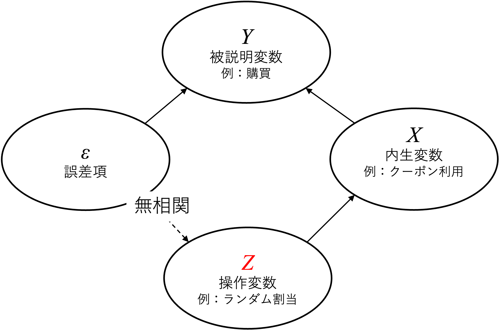

# コラム3（非遵守と操作変数法） {#causation3}
因果推論の代表的な方法として、コラム\@ref(causation2) ではRCTを実施した。しかしながら、着目するリサーチクエスチョン次第では、被験者がランダムに割り当てた処置に従わないような状況も考えられる。例えば、企業がクーポンが購買確率や購買額に与える影響について分析したいと考える際、自社の保有している顧客個人情報のプールから各顧客をランダムにクーポンを受け取るグループ（処置群）と受け取らないグループ（コントロール群）とに割りあて、実験を行うような方法が考えられる。しかしながら、実際に処置群の全ての顧客がクーポンを使うとは限らない。

このような非遵守（ランダムな割り当てと処置の有無が必ずしも一貫しない）の問題を含む状況においては、通常のRCTデザインを仮定した平均の差に関する分析では平均因果効果を分析できない。このような状況においては、「操作変数（Instrumental variable: IV）法」と呼ばれる手法を用いることで、ランダムな割り当てと処置が一貫している遵守者に着目した局所平均因果効果（Local Average Treatment Effect: LATE）を推定できることが知られている（川口・澤田, 2024）。一方でIV法は、因果推論の文脈以外でも活用されてきた方法である。特に、経済学を中心に議論が展開され、マーケティング領域においても広く用いられている手法である（例えば、Lo et al., 2012; Hui et al., 2013）。そのため因果推論に限らないIV法そのものの理解もマーケティング研究においては重要である。
これらの背景を踏まえここでは、IV法を用いた因果推論研究の内容を詳細に伝えるのではなく、より一般的なIV法についての知識を提供することを目的とする。具体的には、IV法の概要について説明した後マーケティングの文脈を例に取り、非遵守者が生じる状況におけるIV法の応用について紹介する。

## 操作変数法の概要
操作変数法は、分析モデルにおける内生変数（endogenous variable）によって生じるバイアスに対応することに主眼を置いた手法として活用されてきた。内生変数とは、回帰モデルにおいて誤差項と相関を持っているような説明変数のことである^[内生変数はもともと、数理的な経済学理論モデルにおいてモデル内で定まる変数のことを指していた。それに対してモデルの外部で決まる外生的な変数は外生変数と呼ばれていた。この内生変数を実証的に分析する際に生じる統計的な問題について議論が洗練化していく過程で、内生変数は「誤差項との相関」に基づき定義されるようになった（西山ほか, 2019）]。

例えば、以下の回帰モデルにおいて説明変数と誤差項との間に相関がある（$Cov(x,u)\neq0$）場合、回帰係数の推定量にバイアスが生じてしまう。この問題を内生性（endgogeneity）と呼ぶ。

$$
Y_i=\beta_0+\beta_1X_i+\epsilon_i
$$

内生性の生じる原因には、（1）欠落変数、（2）同時性（説明変数と被説明変数に両方向の因果関係がある）、（3）測定誤差、（4）セレクションバイアスがある。このような問題に対して、
IVと呼ばれる変数を用いた推定を行うことで、対応することが多い。今回は主に操作変数法の中でも最も広く使われている推定方法の一つである二段階最小二乗法（2SLS）という方法について説明する。

IVは、以下の条件を満たす変数のことを指す。

1. 操作変数 $Z$ は内生変数 $X$ の先行要因になっている

2. $Z$ は元々の回帰式における誤差項 $\epsilon$ と相関しない。

この条件は、以下の図のように表すことができる。なお、下図の例については、\@ref(complier) 節で紹介する分析の構造を反映している。

ここでは簡単化のために単回帰モデルを想定して、２SLSによるIV法について説明する。２SLSでは、その名の通り、操作変数 $Z$を用いた以下のような二段階の推定を行うことで、内生性を克服した分析を試みる：

1. $Z$ を $X$に回帰する：
  - $X_i = \gamma_0+ \gamma_1Z_i+u_i$

2. 1で得た$X$の予測値 $\hat{X}$ を $Y$ に回帰する。
  - $Y_i= \theta_0+\theta_1 \hat{X}_i+\epsilon_i$
  
$\hat{X}$ は $\epsilon$ とは相関を持たないと仮定される $Z$ により説明される $X$ を捉えている。そのため以下の図で示されるように、2段階目で用いられる$\hat{X}$ は操作変数 $Z$ を通じてのみ説明される内生変数 $X$ の変動を抽出したものであると直感的には理解できる。

このようなプロセスによってIV法を用いて内生性（誤差項との相関）を克服することが広く用いられる。また、IV法においては、内生性の克服という統計的性質の他にも、理論的経路の判断に応用されるという特徴を持つ。2SLSによる推定では$Z\rightarrow X\rightarrow Y$ という経路が推定されている。そのため、どのような経緯（$Z$）で変化した $X$ が $Y$ に影響を与えるのかというストーリーについての含意を得ることも、研究上では活用される。しかしながら、実際の分析においては、採用した操作変数が本当に誤差項と相関を持たないのか、操作変数と内生変数の相関は十分に強いのか等、実践的に気をつけるべきポイントがいくつかあり、有効な操作変数を見つけ、分析を行うことは容易ではない。詳細については西山ほか（2019）など計量経済学の教科書を参照してほしい。

## 実験非遵守における操作変数法の活用{#complier}
本節冒頭で述べた通り、クーポンに関する実験のように実験の参加者がランダムに割り当てられた処置に必ず従うとは限らないような状況を考える。例えば、クーポンの配布をランダムに割り当て、1ヶ月間の購買状況を分析するような研究を考える。この時、クーポンを受け取っても利用しない個人もいれば、コントロール群にいながら別の方法でクーポンを入手し利用する個人もいるかも知れない。つまり、ランダム割り当て（$T_i=1$: 処置群; $T_i=0$: コントロール群）と実際のクーポン利用の有無（$D_i=1$: クーポンあり; $D_i=0$: クーポンなし）が一致しないような状況だと考えられる。

この時、$T$ と $D$ の関係から人々を以下の4つのタイプに分類することができる：

- 常に利用者（Always Takers: *AT*): $D_i=1~\text{when}~T_i=0~\text{or}~T_i=1$
- 常に非利用者（Never Takers: *NT*）: $D_i=0~\text{when}~T_i=0~\text{or}~T_i=1$
- 遵守者（Compliers: *C*）: $D_i=0~\text{when}~T_i=0;~~D_i=1~\text{when}~T_i=1$
- 天邪鬼（Defiers: *De*）: $D_i=0~\text{when}~T_i=1;~~D_i=1~\text{when}~T_i=0$

この時、$T$を操作変数$D$ を内生変数とする IV法の枠組みで分析することを考える。前節で参照したように、ランダム化（$T$）を通じてクーポン利用を決めた（$D$）個人の成果変数（$Y$）について考える。そのためには、IVについての仮定（$Cov(Z,X)\neq0$, $Cov(Z,\epsilon)=0$）、除外制約（$Z$は$X$を通じてしか$Y$に影響しない）に加えて、単調性（monotonicity）が満たされると仮定する必要がある。単調性とは、$D_i(T_i = 1)\geq D_i(T_i = 0)$ と定義され、操作変数（ランダム割り当て）と内生変数（クーポンの利用）との関係には一貫性があることを示唆している。言い換えると、*De* のようにクーポンが割り当てられた（抽選にあたった）場合にはクーポンを利用せず、割り当てられなかった場合にはクーポンを利用するというような、天邪鬼な行動は取らないという仮定である。このような仮定が理論的ないしは現実的に満たされる場合、$T$ と $D$ の関係は以下の表のように示される。

Table: (\#tab:monotonicity)仮定のもとでのTとDの関係

|         | $D = 1$ | $D = 0$ |
|:-------:|:-------:|:-------:|
| $T = 0$ |   AT    | C or NT |
| $T = 1$ | C or AT |   NT    |
また、操作変数に関する仮定より、操作変数（$T$）は内生変数（$D$）を通じてのみ成果へ影響する（$Y$）。そのため、*AT* や *NT* のようにつねにクーポン利用行動について取る値が決まっている個人についてはランダム化されたクーポンの効果（観察可能な平均因果効果）はゼロになる。

これらの仮定を満たし、IVが2値である場合（例えば、ランダム割り当ての有無）におけるIV推定モデルを以下のように考える：

1. $D_i=\gamma_0+\gamma_1T_i+u_i$

2. $Y_i=\beta_0+\beta_1\hat{D}_i+\epsilon_i$

このとき、$\beta_1$ は以下のように示される。

$$
\beta_1 = \frac{E[Y_i|T_i=1]-E[Y_i|T_i=0]}{E[D_i|T_i=1]-E[D_i|T_i=0]}=E(Y_{1i}-Y_{0i}|D_{1i}-D_{0i}=1)
$$

ただし、$D_{1i}-D_{0i}=1$はランダム割り当てというIV（$T$）に応じてクーポンの利用（$D$）を変化させた遵守者を示す条件であり、*De*では$D_{1i}-D_{0i}=-1$、*AT*や*NT*では$D_{1i}-D_{0i}=0$になる。そのため、仮定を満たしたうえでIV推定をすることで、遵守者のみに着目した局所平均処置効果（LATE）を求めることができる。この性質は、遵守の強制が難しいトピックや状況における効果測定の際に役立つ手法であり、マーケティング領域での応用も期待できる。

## 参考文献

川口康平・澤田真行 (2024)「因果推論の計量経済学」，日本評論社.

西山慶彦・新谷元嗣・川口大司・奥井亮（2019）「計量経済学」，有斐閣.

Hui, S. K., Inman, J. J., Huang, Y., & Suher, J. (2013). The Effect of In-Store Travel Distance on Unplanned Spending: Applications to Mobile Promotion Strategies. *Journal of Marketing*, 77(2), 1-16. 

Lo, D., Ghosh, M., & Lafontaine, F. (2011). The Incentive and Selection Roles of Sales Force Compensation Contracts. *Journal of Marketing Research*, 48(4), 781-798. 
